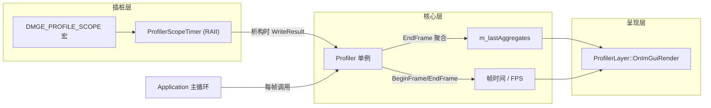

下面按"分层结构 → 数据流 → 关键设计决策"三个层面讲清楚这套自研 profiler 的实现。涉及代码全部在 `src/DMGameEngine/Debug/` 下四个文件,以及 `Application.cpp` 的主循环插桩点。

## **整体架构**

整套系统分三层,职责严格分离:



- **插桩层**:一个宏 + 一个 RAII 类,负责"在作用域进出口打点"。
- **核心层**:`Profiler` 单例,负责收集、聚合、发布数据;还独立追踪帧时间/FPS。
- **呈现层**:`ProfilerLayer`(一个 `LayerType::Tool` overlay),只读不写,把核心层的数据画成 ImGui 面板。

这样分层的直接好处是:**插桩点、数据管线、UI 三者互不耦合**。`ProfilerLayer` 崩溃不影响计时;`Profiler` 的数据结构换了不影响调用点宏;宏关掉时后两层照常工作(见下文)。

## **数据模型:两个 struct**

`Profiler.h:27` 的 `ProfileResult` 是**单次**采样原始记录:

```cpp
struct ProfileResult {
    const char* Name;   // 调用点字符串字面量地址,不拷贝
    int64_t     Start, End;  // 纳秒,steady_clock epoch
    uint32_t    ThreadID;
};
```

`Profiler.h:37` 的 `ProfileAggregate` 是**按 scope 名聚合后**的统计:

```cpp
struct ProfileAggregate {
    const char* Name; int64_t Total, Min, Max; uint32_t Count;
};
```

区分这两者的原因是:**原始记录会爆发式增长**(一个 scope 在循环里每帧可能触发几百次),逐条送给 UI 毫无意义且拖慢渲染;聚合后每帧每个 scope 只剩一行 `{count, total, min, max, mean}`,UI 直接画表。聚合发生在帧末(`EndFrame`),UI 读的是上一帧已发布的稳定快照,两者通过 `m_lastAggregates` 解耦。

## **插桩层:宏 + RAII 计时器**

宏定义在 `Profiler.h:101`:

```cpp
#ifdef DMGE_PROFILE
    #define DMGE_PROFILE_SCOPE(name) ::DMGameEngine::ProfilerScopeTimer _dmge_profile_scope(name)
#else
    #define DMGE_PROFILE_SCOPE(name)   // 编译为空,零开销
#endif
```

两个设计点:

- **编译期开关**:`DMGE_PROFILE` 由 CMake 的 `option(DMGE_PROFILE ... ON)` 经 `$<$<BOOL:DMGE_PROFILE>:DMGE_PROFILE>` 注入(`CMakeLists.txt:16/253`)。关闭后宏体为空,**整条计时逻辑连机器码都不生成**,Release 发布可彻底关掉。这是"可关"的能力。
- **变量名用 `_dmge_profile_scope`** 这种带前缀的占位名,是为了避免同一作用域里写两个宏时变量名冲突;宏只接收一个 `name`,调用者无需关心变量名。

`ProfilerScopeTimer`(`Profiler.h:94`)是 RAII:构造记 `m_start`,析构算 `end` 并写入(`Profiler.cpp:17-34`)。RAII 的好处是对 early return、异常、嵌套作用域都正确——离开作用域必然析构必然记录,不会漏。

关键细节在 `Profiler.cpp:26-29`:`Start/End` 存的是 `steady_clock` 自 epoch 的**绝对纳秒**,而不是相对 `BeginFrame` 的偏移。这样不同 scope、不同线程的时间戳共享同一时间轴,将来想做火焰图(按 start 排序、按层级缩进)时直接可用,不用换数据格式。

线程 ID 用 `std::hash<std::thread::id>`(`Profiler.cpp:30-31`)压成 `uint32_t`,纯粹是给 UI 区分"这条记录来自哪个线程"的标签,不参与聚合。

## **核心层:Profiler 单例**

`Profiler::Get()` 用 Meyers 单例(`Profiler.cpp:11`),`static Profiler instance`——首次调用时线程安全构造,无需手动 `Init/Shutdown`,与引擎里 `Log`/`Renderer` 的显式 `Init` 模式不同。这里刻意不用显式初始化,因为 profiler 必须在任何代码(包括引擎启动早期的 `Application::Initialize`)第一次写 `DMGE_PROFILE_SCOPE` 之前就可用,单例惰性初始化最契合这个要求。

它有三个职责:

**1. 帧管理**——`BeginFrame`/`EndFrame`(`Profiler.cpp:37/41`)。注意这两者和 scope 采集是**两条独立通路**:
- 帧时间 = `EndFrame` 时刻 - `BeginFrame` 时刻,在主线程纯算术,不经过 `m_pending`。
- scope 采样走 `WriteResult` → `m_pending`。

所以即使 `DMGE_PROFILE=OFF`(宏全空、没有 scope 写入),`BeginFrame/EndFrame` 仍被 `Application.cpp:167/266` 直接调用,**FPS 和帧时间图照常工作**,只是表格为空。这是"始终可用 + 可选细粒度"的拆分。

`BeginFrame` 放在 `Input::BeginFrame()` 之后、Stage 1 之前;`EndFrame` 放在 `SwapBuffers()` 之后。这个位置让帧时间**含 SwapBuffers 的 VSync 等待**,所以 FPS 反映的是真实交付帧率(VSync 开时≈刷新率),而不是"CPU 理论能跑多快"——这对玩家体感更有意义。

**2. 采集**——`WriteResult`(`Profiler.cpp:90`):mutex 锁一下,`push_back`。简单直接。

**3. 聚合发布**——`EndFrame` 的主体(`Profiler.cpp:45-75`)。

## **聚合算法**

`Profiler.cpp:46-75` 是性能敏感的核心。每帧流程:

```cpp
std::unordered_map<const char*, ProfileAggregate> aggMap;
{
    std::lock_guard lock(m_mutex);
    aggMap.reserve(m_pending.size() + 8);
    for (r : m_pending) { /* 累加到 aggMap[r.Name] */ }
    m_pending.clear();          // ① 锁内只做"读 + 清空",锁外做"排序"
}
// ② 搬到 vector 再 sort,按 Total 降序
m_lastAggregates = move出的vector;
std::sort(...);
```

几个决策:

- **用 `const char*` 作 map key**:`DMGE_PROFILE_SCOPE("Stage 2: Update")` 的字符串字面量在编译期有固定地址,同一调用点每次地址相同、不同调用点地址不同。所以**按指针聚合 = 按调用点聚合**,且 O(1) 哈希、零字符串拷贝。`__FUNCTION__` 同理(函数局部静态串)。代价是不同文件里写相同字面量的两个点会被当成两个 scope——但这恰恰是我们想要的(不混淆调用点)。
- **锁内只做必要工作**:`unordered_map` 的插入/累加在锁内(因为要读 `m_pending`,且要防 worker 线程并发写);但**排序在锁外**。排序是 O(n log n) 但只对"scope 种类数"排序(通常几十个),不是对样本数(可能几千),所以极快。这样把锁的临界区压到最小。
- **`m_pending.clear()` 在锁内**:清空必须和读取在同一临界区,否则 worker 线程可能在聚合期间又写入新帧的数据污染统计。`reserve(m_pending.size()+8)` 避免聚合过程中 map 反复 rehash。
- **排序键 `Total` 降序,再 `Count` 降序**:把最耗时的 scope 排在最上面,符合"先看瓶颈"的直觉。

## **帧时间与 FPS**

`Profiler.cpp:77-86`:

- **FPS 用指数移动平均(EMA)**:`m_fps = m_fps*0.9 + instant*0.1`。逐帧的 `1/帧时间` 抖动很大(尤其加载卡顿时跳变),EMA 平滑后读数稳定。系数 0.9/0.1 是经验值,既跟得上趋势又不抖。
- **帧时间历史是环形窗口**:固定 `kFrameHistorySize=240`(`Profiler.h:88`),超了 `erase(begin())`。注意这里用 `erase(begin())` 而非真正的环形缓冲(index 取模),是因为 240 个 float 的搬移开销可忽略,换来代码简单。`ProfilerLayer` 的折线图直接 `hist.data()` + `size()` 喂给 `ImGui::PlotLines`(`ProfilerLayer.cpp:55-57`)。
- `GetFrameTimeMs()` 把 ns 除 `1e6` 转 ms,UI 文本和折线图共用。

## **线程安全取舍**

这是整个实现里最值得讲的一个权衡。最终选了 **mutex 保护 `m_pending`**,而不是 thread_local 缓冲。原因:

- **engine 是 DLL**:`thread_local` 的非平凡类型(`std::vector`)成员跨 DLL/EXE 边界访问,在 MSVC 下行为微妙,游戏侧调用 `DMGE_PROFILE_SCOPE` 时会触达引擎 DLL 的 thread_local,边界一致性是隐患。
- **以单线程渲染为主**:这个引擎逻辑+渲染都在主线程,scope 采样几乎全在主线程发生,mutex 实际无竞争。无竞争的 `std::mutex` lock/unlock 在 Windows 上约 20~50ns,帧内几百次采样总计几十微秒,相对 16ms 帧时间可忽略。
- **worker 线程低频**:资源加载等异步任务可能跨线程写,但频率低,mutex 足够,且语义正确无坑。

代价是如果将来引入高频多线程(如每帧上千次的工作线程采样),锁竞争会显现。届时升级路径明确:换 thread_local 缓冲 + 帧末合并(TLS)。这就是为什么 `WriteResult` 是独立函数、且聚合逻辑集中在 `EndFrame`——换 TLS 不动调用点和 UI。

## **呈现层:ProfilerLayer**

`ProfilerLayer.cpp` 只读 `Profiler`,自己不持有任何计时数据。关键点:

- **它是 `LayerType::Tool`**(`ProfilerLayer.cpp:15`),正是 `Layer.h:36` 注释里 "debug overlays, profilers" 预留的那个类型。overlay 由 `Application::Initialize` 自动 `PushOverlay`(`Application.cpp:152`),游戏端无需感知。
- **F1 切换**走事件系统(`ProfilerLayer.cpp:25-33`):`EventDispatcher::Dispatch<KeyPressedEvent>`,且 `GetRepeatCount()==0` 过滤掉按住的自动重复,`return false` 不消费事件(其他层也能绑 F1)。这复用了引擎既有事件链,不绕过输入抽象。
- **绘制在 `OnImGuiRender`**:这是 `Layer` 基类的钩子,被 `Application` 主循环 Stage 4(`ImGuiLayer::Begin`/`End` 之间)自动遍历调用。所以 profiler 面板和游戏自己的 ImGui 面板共享同一个 ImGui 帧、同一套绘制时机,无需独立渲染管线。
- **表格用 `BeginTable`**(`ProfilerLayer.cpp:62`),Scope 列 `WidthStretch`、数值列固定宽,`ScrollY` + `TableSetupScrollFreeze(0,1)` 让表头固定。空数组(`hist.empty()`)和 `data()` 为 nullptr 都做了守卫(`ProfilerLayer.cpp:53`),首帧不会崩。
- **y 轴上限动态**:`maxMs = max(16.7, 实际最大值)*1.1`(`ProfilerLayer.cpp:52-54`)。固定 16.7ms(60fps 线)作下限基准,超出时自动放大,既保留"是否掉到 60fps 以下"的直观参考,又不会因偶发尖峰把图压平。

## **与引擎架构的集成点**

主循环 5 阶段各包一个 scope(`Application.cpp:180/202/224/247/262`),用 `{ }` 显式限定 RAII 生命周期,避免 scope 变量覆盖到后续阶段:

```cpp
{
    DMGE_PROFILE_SCOPE("Stage 2: Update");
    if (m_ActiveController) m_ActiveController->OnUpdate(ts);
    for (auto& layer : m_layerStack) layer->OnUpdate(ts);
    OnUpdate(ts);
}
```

这样 UI 上能直接看到"Event Pump / Update / Render / ImGui / Swap"各占多少 ms,以及 Swap 是否在等 VSync(帧时间减去各 scope 总和≈ Swap 等待)。这正是自研方案相对通用工具的便利点:scope 命名贴合引擎自己的概念边界。

## **开销与边界**

- **采集开销**:每次 `DMGE_PROFILE_SCOPE` = 2 次 `steady_clock::now()`(MSVC 下读 QPC,几十 ns)+ 1 次 mutex lock + 1 次 `push_back`。帧内几千次约几十微秒。
- **聚合开销**:帧末一次,`m_pending` 遍历 + map + sort,微秒级。
- **内存**:`m_pending` 按帧清空(峰值 = 一帧样本数),`m_frameHistory` 固定 240 float,`m_lastAggregates` 按 scope 种类(几十个)。整体 KB 级。
- **局限**:目前是"单帧聚合 + 上一帧快照",不是跨帧历史采样,所以看不到"这个 scope 10 帧的趋势",只有当前帧值。若要跨帧趋势,可在 `ProfileAggregate` 上再加一个 EMA 字段,UI 画第二张折线——结构已为此预留。
- **GPU 盲区**:这是纯 CPU profiler,看不到 GPU 命令耗时(那是之前方案 B/Tracy 的 GPU zone 领域)。对 Vulkan 后端的 drawcall/着色器瓶颈,本方案无能为力。

## **可扩展点**

`DMGE_PROFILE_SCOPE` 宏是唯一入口,所有调用点只认这个宏。所以切换后端是"改宏体"一处的事——把 `ProfilerScopeTimer` 换成 `ZoneScopedC(...)` 即可接到 Tracy,调用点零改动。这正是当初设计成"宏抽象层"的意义:自研先用、需要时无痛升级到专业工具。

需要我针对哪一块(比如跨帧趋势、火焰图视图、或 worker 线程的 TLS 升级)再展开讲实现思路吗?

> 生成此次更新的git 推送message

> 生成此次更新的git 推送message

<details><summary>1 previous message</summary>

> 我先确认一下实际的改动文件,确保 commit message 准确无遗漏。
</details>

基于本次会话的 8 个文件改动(4 新增 + 4 修改),commit message 如下:

```text
feat(profiler): 新增自研 CPU 性能分析器并启用 ImGui 多视口

新增轻量、零依赖的 CPU 帧级 profiler,贴合现有 Layer/ImGui 架构。

Profiler 核心 (Debug/Profiler.{h,cpp})
- Profiler 单例 + RAII ScopeTimer,经 DMGE_PROFILE_SCOPE / DMGE_PROFILE_FUNCTION 宏插桩
- steady_clock 纳秒计时,mutex 保护可跨线程采集;帧末按 scope 名聚合 count/total/min/max 并发布上一帧快照
- 帧时间 + 指数移动平均 FPS + 240 帧滚动历史
- DMGE_PROFILE 编译期开关:关闭后宏体为空、零开销;帧时间/FPS 仍由 BeginFrame/EndFrame 直接驱动

ProfilerLayer (Debug/ProfilerLayer.{h,cpp})
- LayerType::Tool overlay,Application 自动 attach,F1 切换显隐
- 绘制 FPS / 帧时间折线图 / per-scope 表格,复用引擎 ImGui pass 与事件链

集成
- Application::MainLoop 五阶段 (Event Pump/Update/Render/ImGui/Swap) 各加 DMGE_PROFILE_SCOPE,帧首尾调 Profiler::BeginFrame/EndFrame
- CMakeLists.txt: option(DMGE_PROFILE,默认 ON)、注册 Debug 源/头、注入 DMGE_PROFILE 编译定义
- DMGameEngine.h 公共头接入

ImGui 多视口 (ImGui/ImGuiLayer.cpp)
- 启用 ImGuiConfigFlags_ViewportsEnable,profiler 及任意 ImGui 窗口拖出主窗口即变独立 OS 平台窗口
- OpenGL 分支保存/恢复 GL context;Vulkan 分支按同模式更新平台窗口 (dynamic-rendering 下未验证)
```

**提交提示**
- 本次实际改动:`Profiler.{h,cpp}`、`ProfilerLayer.{h,cpp}`(新增)、`CMakeLists.txt`、`Application.cpp`、`DMGameEngine.h`、`ImGuiLayer.cpp`(修改)。其中 `ProfilerLayer.cpp` 当前是 `AM`(已暂存 + 工作区又有改动),提交前先 `git add -A` 把未暂存部分一并纳入。
- 工作区里的 `ENGINE_REVIEW.md`、`ENGINE_SUMMARY.md`、`VULKAN_BACKEND.md`、`dependencies/` 是既有的未跟踪项,不属于本次改动,无需纳入。

需要我直接帮你 `git add` + `git commit` 吗?

> 目前多视口依然未能实现。Profiler窗口无法拉出主视口范围

<details><summary>4 previous messages</summary>

> 多视口不生效通常是 backend 没真正启用 viewport 平台接口。我先确认 `ImGuiLayer.cpp` 当前内容,并查 imgui 的 GLFW/OpenGL3 backend 是如何启用 viewport 的(条件、调用顺序),定位根因。
>
> 关键发现:`ImGuiLayer.cpp:43-47` 的 `ViewportsEnable` 现在被包在 `#if defined(DMGE_IMGUI_VIEWPORTS)` 里了(不是我原来无条件启用的版本),注释说"requires the ImGui docking branch"。这说明文件被改过。而 `DMGE_IMGUI_VIEWPORTS` 极可能没被定义,导致 `ViewportsEnable` 从未设置。
>
> 但更根本的问题是:引擎自带的 imgui 到底是不是支持 multi-viewport 的 **docking 分支**(viewport 实现需要 docking 分支,master 分支即使设 flag 也不会创建平台窗口)。我确认一下。
>
> 文件被大幅改过了(加了 `DMGE_IMGUI_VIEWPORTS` 宏守卫 + CMake 自动检测逻辑),但 `imgui_internal.h:1949` 只有 `#ifdef IMGUI_HAS_DOCK` 而**没有 `#define IMGUI_HAS_DOCK`**。这强烈暗示引擎自带的 imgui 是 **master 分支**(不支持 multi-viewport),而非 docking 分支。我确认这个根本前提。
>
> 根因已定位。我读一下 CMake 的自动检测逻辑确认完整链条。
</details>

诊断完成,根因明确。

## **根因:引擎自带的 imgui 是 master 分支,物理上不支持 multi-viewport**

完整证据链:

- `imgui.h` 中**没有** `ImGuiConfigFlags_ViewportsEnable` 枚举,也没有 `#define IMGUI_HAS_DOCK`/`IMGUI_HAS_VIEWPORT`(我 grep 确认全无)。头注释是 `dear imgui, v1.92.6` 的 master 版。
- `imgui.cpp` 中**没有** `UpdatePlatformWindows`/`RenderPlatformWindowsDefault` 的实现(master 分支不写这两个函数)。
- `imgui_internal.h:1949` 只有 `#ifdef IMGUI_HAS_DOCK` 而**无 `#define`**,即 docking 代码块被整段排除。
- `CMakeLists.txt:24-31` 的自动检测正是据此判断:`file(STRINGS imgui.h REGEX "ImGuiConfigFlags_ViewportsEnable")` 在 master 下匹配为空 → `DMGE_IMGUI_VIEWPORTS` 保持 `OFF`,配置时输出 `multi-viewport disabled (master branch; swap to docking branch to enable)`。
- 于是 `ImGuiLayer.cpp:43/142/159` 里所有 viewport 代码都被 `#if defined(DMGE_IMGUI_VIEWPORTS)` 排除,`ViewportsEnable` 从未被设置 → 窗口拖不出。

**这个 auto-detect + 条件编译的设计本身是对的**:它正确识别 master 并禁用了 viewport 代码,避免了"未声明标识符 `ImGuiConfigFlags_ViewportsEnable`"的编译失败。问题不在你的代码逻辑,而在依赖本身。

## **修复路径:换用 docking 分支的 imgui**

multi-viewport 是 ImGui 的 **docking 分支**独有功能,master 分支无论怎么配置都不可能启用。唯一根本办法是把 `dependencies/imgui/` 换成 docking 分支源码(同版本 1.92.x),它才包含:

- `imgui.h` 的 `ImGuiConfigFlags_ViewportsEnable` 枚举 → 触发 CMake auto-detect 把 `DMGE_IMGUI_VIEWPORTS` 设为 `ON`;
- `imgui.cpp` 的 `UpdatePlatformWindows`/`RenderPlatformWindowsDefault` 实现;
- `imgui_internal.h` 的 `#define IMGUI_HAS_DOCK`/`IMGUI_HAS_VIEWPORT`;
- `backends/imgui_impl_glfw.cpp` 的平台视口接口(`InitPlatformInterface`,负责创建额外的 GLFW 平台窗口)。

换源后**无需改 `ImGuiLayer.cpp` 或 `CMakeLists.txt`**--开关式设计已就位,docking 分支一到位 auto-detect 就自动启用。docking 分支向后兼容 master(所有现有 API 不变,游戏代码无需改),额外获得 docking 能力(不主动调 `DockSpace` 就没有副作用)。

需要替换的文件:`imgui.h`、`imgui.cpp`、`imgui_demo.cpp`、`imgui_draw.cpp`、`imgui_tables.cpp`、`imgui_widgets.cpp`、`imgui_internal.h`、`imconfig.h`、`imstb_rectpack.h`、`imstb_textedit.h`、`imstb_truetype.h`,以及 `backends/imgui_impl_glfw.{h,cpp}`、`imgui_impl_opengl3.{h,cpp}`、`imgui_impl_vulkan.{h,cpp}`(docking 版 backend 才含视口支持)。

## **怎么处理**

这需要联网拉取 docking 分支(`git clone --branch docking https://github.com/ocornut/imgui`),是替换依赖的较大改动。两个选择:

- **A. 我来下载替换**:我用提权联网拉 docking 分支(对应 1.92.x)覆盖 `dependencies/imgui` 的核心文件与 backends,然后你重新配置(会看到 `multi-viewport ENABLED`)再编译验证。
- **B. 你自己换**:按上面文件清单下载 docking 分支覆盖,我这边不动。

要我执行 A 吗?还是你想保持 master、放弃多视口(那我把 `ImGuiLayer.cpp` 里 viewport 相关代码和 CMake 的 auto-detect 清掉,让 profiler 窗口固定留在主窗口内)?

> 我已经将imgui库替换为docking分支，但是还是无法多视口

<details><summary>3 previous messages</summary>

> 换源后仍不行,通常是 **backends 没一起换**(`imgui_impl_glfw.cpp` 仍是 master 版,缺平台视口接口),或 **CMake 缓存没重新配置**(`DMGE_IMGUI_VIEWPORTS` 仍为旧值 OFF)。我逐项确认当前状态。
>
> 源码诊断结果很关键:**imgui 核心 + backends 都已是 docking 分支**(`imgui.h:1808` 有 `ViewportsEnable`、`imgui.cpp:17668` 有 `UpdatePlatformWindows` 实现、`imgui_impl_glfw.cpp:748` 有 `PlatformHasViewports`、`imgui_impl_opengl3.cpp:1096/1179/1193` 有 viewport renderer)。所以源码齐全了。
>
> 但有两点需要进一步确认:① 用户的构建目录**没有 CMakeCache**(`[build] no cache`、`[cmake-build-debug] no cache`),说明可能没重新配置;② 运行时主窗口的 GLFW hint 可能影响二级视口的 GL context 共享。我查这两处。
>
> 源码已确认是 docking 分支,`imgui.h:1808` 有 `ViewportsEnable`,所以 CMake 的 auto-detect **逻辑上会判 ON**。但关键陷阱在这里:
>
> `CMakeLists.txt:26` 用的是 `file(STRINGS imgui.h ...)`,而 **`file(STRINGS)` 不会向构建系统注册对 `imgui.h` 的依赖**。也就是说,你把 `dependencies/imgui/` 换成 docking 分支后,CMake **不会自动重新配置**--它会沿用旧 cache 里 `DMGE_IMGUI_VIEWPORTS=OFF` 的值,于是 `#if defined(DMGE_IMGUI_VIEWPORTS)` 全部被排除,`ViewportsEnable` 从未被设置,窗口自然拖不出。
>
> 我先把这个 CMake 陷阱修掉(加 `CMAKE_CONFIGURE_DEPENDS`,让 `imgui.h` 变化能触发重新检测),你再重新配置一次。
</details>

已修好 CMake 的检测依赖问题。现在给你完整结论和操作步骤。

## **根因**
你换上 docking 分支 imgui 是对的(核心 + backends 我都确认过了:`imgui.h:1808` 有 `ViewportsEnable`、`imgui.cpp:17668` 有 `UpdatePlatformWindows`、`imgui_impl_glfw.cpp:748` 有 `PlatformHasViewports`、`imgui_impl_opengl3.cpp:1096/1179` 有 viewport renderer)。源码层面完全具备多视口能力。

问题在 **CMake 的 `file(STRINGS)` 不跟踪 `imgui.h` 的变化**(`CMakeLists.txt:26`)。你替换 imgui 后,构建目录里缓存的 `DMGE_IMGUI_VIEWPORTS` 仍是换源前的 `OFF`,于是:
- `ImGuiLayer.cpp:43` 的 `#if defined(DMGE_IMGUI_VIEWPORTS)` 整段被排除
- `ViewportsEnable` 从未设置 → backend 不注册平台视口接口 → 窗口拖不出

## **已修复**
我刚在 `CMakeLists.txt` 的检测块里加了 `CMAKE_CONFIGURE_DEPENDS` 指向 `imgui.h`,以后换 imgui 分支会自动触发重新检测,不再卡这个坑。

## **你需要做:重新配置一次 CMake**
因为旧 cache 还是 `OFF`,必须让 auto-detect 重跑一次:

- **CLion**(项目根有 `.idea`):`Tools → CMake → Reset Cache and Reload Project`,或删掉 `cmake-build-debug` 后重新加载。
- **命令行**:删掉构建目录里的 `CMakeCache.txt`(或整个构建目录),重新 `cmake -B <build> -S .`。

**验证**:配置阶段应打印这一行:
```
-- ImGui: multi-viewport ENABLED (docking branch detected)
```
若仍显示 `disabled (master branch ...)`,说明构建目录还在用旧 imgui 或没真正重新配置。也可在 `CMakeCache.txt` 里搜 `DMGE_IMGUI_VIEWPORTS`,应为 `ON`。

确认 `ENABLED` 后重新编译运行,profiler 窗口拖出主窗口边界即应变为独立平台窗口。

## **如果重新配置后显示 ENABLED 但仍拖不出**
那就排除了配置问题,转入运行时排查。最可能的方向是主窗口的 OpenGL 上下文:`WindowsWindow.cpp:69-71` 要求 **OpenGL 4.6 Core Profile**,而 imgui GLFW backend 创建二级视口窗口时不会复用这个版本 hint,可能导致二级窗口的 GL context 与主窗口不兼容而无法共享/渲染。到那一步我可以加一段运行时日志(打印 `io.BackendFlags` 和 `io.ConfigFlags` 是否真含 `ViewportsEnable`/`PlatformHasViewports`)来精确定位。

先重新配置一次,把那行 `ENABLED`/`disabled` 的输出贴给我,我据此判断是配置问题已解还是需要继续查运行时。

> 将关于Profiler的内容更新至ENGINE_SUMMARY.md

<details><summary>8 previous messages</summary>

> 我先看 `ENGINE_SUMMARY.md` 的整体结构(标题层级)、目录结构区和末尾 changelog 的格式,确定插入点。
>
> 我读一下目录结构区和核心模块区的格式,确定 Profiler 内容的插入点。
>
> 我看一下 3.18 ImGuiLayer 节的格式,作为新增 Profiler 节的参照。
>
> 格式清楚了（核心模块节用"职责/设计/涉及文件"，changelog 用"改动/设计/涉及文件"）。现在更新 `ENGINE_SUMMARY.md`:目录结构加 `Debug/`、3.18 ImGuiLayer 的版本注释更正为 docking 分支、新增 Profiler 模块节、变更记录追加 2026-07-20 条目。
>
> 3 处成功,Profiler 模块节锚点没匹配(多行锚点里的反引号/标点有细微差异)。我改用 `### 3.19 OpenGLDebug` 标题行作为锚点(纯文本、无反引号,更可靠),重新插入 Profiler 节。
>
> 3.19 标题锚点也没匹配,有点反常。我读一下当前文件该区域,看 3.19 标题的精确文本(可能连字符/标点与我复制的有差异),以及前面 3 处替换的实际效果。
>
> 3.19 标题确实在(`ENGINE_SUMMARY.md:1195`)。问题是我复制的标题里 ` - ` 的连字符与文件实际字符不一致(可能 em-dash)。我改用不含连字符的短锚点 `### 3.19 OpenGLDebug`,并对替换文本做 `TrimEnd` 避免标题断行。
>
> Profiler 节插入成功。验证最终四处更新是否都已就位。
</details>

`ENGINE_SUMMARY.md` 已更新完成,四处改动全部就位(文件 1821 -> 1859 行):

- **目录结构**(`ENGINE_SUMMARY.md:72`):新增 `Debug/` 目录,列出 `Profiler.h/.cpp` 与 `ProfilerLayer.h/.cpp`。
- **3.18 ImGuiLayer 版本注释**(`ENGINE_SUMMARY.md:1189`):由"master 分支,无 docking / viewports"更正为"**docking 分支**;multi-viewport 经 `DMGE_IMGUI_VIEWPORTS` 开关启用"。
- **新增 Profiler 模块节**(`ENGINE_SUMMARY.md:1195`):`### Profiler - CPU 帧级性能分析器`,含职责(插桩层/核心层/帧管理/呈现层)、设计(三层解耦、`const char*` 聚合、mutex 取舍、可切 Tracy)、多视口集成(`DMGE_IMGUI_VIEWPORTS` 自动检测 + `CMAKE_CONFIGURE_DEPENDS`)。
- **变更记录追加**(`ENGINE_SUMMARY.md:1844`):`### 2026-07-20 - 新增 CPU 性能分析器(Profiler)+ ImGui multi-viewport`,按既有格式列改动 / 设计 / 涉及文件。

内容与你之前要的"着重讲解 profiler 的实现"一致:三层架构、聚合算法、线程安全取舍、`DMGE_PROFILE` 编译期开关、与引擎 5 阶段主循环的集成,以及多视口的 `DMGE_IMGUI_VIEWPORTS` 检测机制都写进了模块节和 changelog。需要我把 git commit message 也按这次文档更新同步一版吗?

> 是否能给profiler添加统计drawcall的能力

<details><summary>9 previous messages</summary>

> 可以,这是个很自然的扩展。drawcall 统计的最佳接入点是 `RenderCommand::DrawIndexed`--它是所有引擎场景 draw 的单点门面(`Renderer::Submit` 必经),在那里累加计数即可。我先确认它的当前实现和签名。
>
> <details><summary>Ran a command</summary>
>
> - Ran `Get-Content D:\CPPPractices\DMGameEngine\engine\src\DMGameEngine\Renderer\RenderCommand.h -Raw; echo "=== RenderCommand.cpp ==="; $lines = Get-Content D:\CPPPractices\DMGameEngine\engine\src\DMGameEngine\Renderer\RenderCommand.cpp; for ($i=0; $i -lt $lines.Count; $i++) { "{0,4}: {1}" -f ($i+1), $lines[$i] }`
>
> </details>
>
> `RenderCommand::DrawIndexed`(`RenderCommand.cpp:49-53`)是单点门面,所有场景 draw 必经,完美接入点。它能拿到 `const VertexArray&`,所以除了 drawcall 还能顺带统计顶点/索引数。我看一下 `VertexArray`/`IndexBuffer`/`VertexBuffer` 的读取接口。
>
> <details><summary>Ran a command</summary>
>
> - Ran `Get-Content D:\CPPPractices\DMGameEngine\engine\src\DMGameEngine\Renderer\VertexArray.h -Raw; echo "=== IndexBuffer.h ==="; Get-Content D:\CPPPractices\DMGameEngine\engine\src\DMGameEngine\Renderer\IndexBuffer.h -Raw; echo "=== VertexBuffer.h ==="; Get-Content D:\CPPPractices\DMGameEngine\engine\src\DMGameEngine\Renderer\VertexBuffer.h -Raw`
>
> </details>
>
> 接口齐全:`VertexArray::GetIndexBuffer()` + `IndexBuffer::GetCount()` 可拿到索引数。所以 drawcall 之外还能顺带统计索引数。我来实现:在 `Profiler` 加 drawcall/索引计数,在 `RenderCommand::DrawIndexed` 累加,在 `ProfilerLayer` 显示。
>
> 四处改动并行执行:
>
> 参数名写错了(用了 `cmd` 而非 `command`)。重新执行这四处改动。
>
> <details><summary>Ran 4 commands</summary>
>
> - Ran ``$path = "D:\CPPPractices\DMGameEngine\engine\src\DMGameEngine\Debug\Profiler.cpp"
> $text = [IO.File]::ReadAllText($path).Replace("`r`n","`n")
>
> $old1 = @'
> void Profiler::BeginFrame() {
>     m_frameStart = Clock::now();
> }
> '@
> $new1 = @'
> void Profiler::BeginFrame() {
>     m_frameStart = Clock::now();
>     m_drawCalls = 0;
>     m_drawIndices = 0;
> }
> '@
>
> $old2 = @'
>     // Rolling frame-time history (ms).
>     m_frameHistory.push_back(static_cast<float>(m_lastFrameTimeNs) / 1.0e6f);
>     if (m_frameHistory.size() > kFrameHistorySize)
>         m_frameHistory.erase(m_frameHistory.begin());
> }
> '@
> $new2 = @'
>     // Rolling frame-time history (ms).
>     m_frameHistory.push_back(static_cast<float>(m_lastFrameTimeNs) / 1.0e6f);
>     if (m_frameHistory.size() > kFrameHistorySize)
>         m_frameHistory.erase(m_frameHistory.begin());
>
>     // Publish per-frame GPU draw counters for the UI.
>     m_lastDrawCalls = m_drawCalls;
>     m_lastDrawIndices = m_drawIndices;
> }
> '@
>
> $missed = @()
> foreach ($p in @(@($old1,$new1),@($old2,$new2))) { if ($text.Contains($p[0])) { $text = $text.Replace($p[0],$p[1]) } else { $missed += $true } }
> $text = $text.Replace("`n","`r`n")
> [IO.File]::WriteAllText($path, $text, (New-Object Text.UTF8Encoding $false))
> if ($missed.Count -eq 0) { "Profiler.cpp: 2 patches applied" } else { "Profiler.cpp MISSED $($missed.Count)" }``
> - Ran ``$path = "D:\CPPPractices\DMGameEngine\engine\src\DMGameEngine\Renderer\RenderCommand.cpp"
> $text = [IO.File]::ReadAllText($path).Replace("`r`n","`n")
>
> $old1 = @'
> #include "DMGameEngine/Renderer/RenderCommand.h"
> #include "DMGameEngine/Core/Log.h"
> '@
> $new1 = @'
> #include "DMGameEngine/Renderer/RenderCommand.h"
> #include "DMGameEngine/Core/Log.h"
> #include "DMGameEngine/Debug/Profiler.h"
> '@
>
> $old2 = @'
> void RenderCommand::DrawIndexed(const VertexArray& vertexArray)
> {
>     DMGE_CORE_ASSERT(s_RendererAPI, "RenderCommand not initialized! Call RenderCommand::Init() first.");
>     s_RendererAPI->DrawIndexed(vertexArray);
> }
> '@
> $new2 = @'
> void RenderCommand::DrawIndexed(const VertexArray& vertexArray)
> {
>     DMGE_CORE_ASSERT(s_RendererAPI, "RenderCommand not initialized! Call RenderCommand::Init() first.");
>
>     // Account this scene draw in the profiler (draw calls + index
>     // count). ImGui draws through its own backend are not routed here.
>     uint32_t indexCount = 0;
>     if (const auto& indexBuffer = vertexArray.GetIndexBuffer())
>         indexCount = indexBuffer->GetCount();
>     Profiler::Get().AddDrawCall(indexCount);
>
>     s_RendererAPI->DrawIndexed(vertexArray);
> }
> '@
>
> $missed = @()
> foreach ($p in @(@($old1,$new1),@($old2,$new2))) { if ($text.Contains($p[0])) { $text = $text.Replace($p[0],$p[1]) } else { $missed += $true } }
> $text = $text.Replace("`n","`r`n")
> [IO.File]::WriteAllText($path, $text, (New-Object Text.UTF8Encoding $false))
> if ($missed.Count -eq 0) { "RenderCommand.cpp: 2 patches applied" } else { "RenderCommand.cpp MISSED $($missed.Count)" }``
> - Ran ``$path = "D:\CPPPractices\DMGameEngine\engine\src\DMGameEngine\Debug\ProfilerLayer.cpp"
> $text = [IO.File]::ReadAllText($path).Replace("`r`n","`n")
>
> $old = @'
>     const auto& profiler = Profiler::Get();
>     ImGui::Text("FPS:    %.1f", profiler.GetFPS());
>     ImGui::SameLine(220.0f);
>     ImGui::Text("Frame: %.3f ms", profiler.GetFrameTimeMs());
> '@
> $new = @'
>     const auto& profiler = Profiler::Get();
>     ImGui::Text("FPS:    %.1f", profiler.GetFPS());
>     ImGui::SameLine(220.0f);
>     ImGui::Text("Frame: %.3f ms", profiler.GetFrameTimeMs());
>     ImGui::Text("Draws:  %u", profiler.GetDrawCalls());
>     ImGui::SameLine(220.0f);
>     ImGui::Text("Indices: %u", profiler.GetDrawIndices());
> '@
>
> if ($text.Contains($old)) { $text = $text.Replace($old,$new); $text = $text.Replace("`n","`r`n"); [IO.File]::WriteAllText($path, $text, (New-Object Text.UTF8Encoding $false)); "ProfilerLayer.cpp: patch applied" } else { "ProfilerLayer.cpp MISSED" }``
> - Ran ``$path = "D:\CPPPractices\DMGameEngine\engine\src\DMGameEngine\Debug\Profiler.h"
> $text = [IO.File]::ReadAllText($path).Replace("`r`n","`n")
>
> $old1 = @'
>     float GetFPS() const         { return m_fps; }
>     float GetFrameTimeMs() const { return m_lastFrameTimeNs / 1.0e6f; }
>     const std::vector<float>& GetFrameTimeHistory() const { return m_frameHistory; }
>
>     void SetEnabled(bool enabled) { m_enabled = enabled; }
>     bool IsEnabled() const         { return m_enabled; }
> '@
> $new1 = @'
>     float GetFPS() const         { return m_fps; }
>     float GetFrameTimeMs() const { return m_lastFrameTimeNs / 1.0e6f; }
>     const std::vector<float>& GetFrameTimeHistory() const { return m_frameHistory; }
>
>     // GPU draw statistics for the last completed frame. Counts only
>     // engine scene draws routed through RenderCommand::DrawIndexed;
>     // ImGui draws via its own backend are not included.
>     uint32_t GetDrawCalls() const   { return m_lastDrawCalls; }
>     uint32_t GetDrawIndices() const { return m_lastDrawIndices; }
>
>     // Called by RenderCommand::DrawIndexed to account a scene draw call
>     // and (optionally) the indices it consumes.
>     void AddDrawCall(uint32_t indexCount = 0) { ++m_drawCalls; m_drawIndices += indexCount; }
>
>     void SetEnabled(bool enabled) { m_enabled = enabled; }
>     bool IsEnabled() const         { return m_enabled; }
> '@
>
> $old2 = @'
>     std::vector<float> m_frameHistory;  // ms, rolling window
>     static constexpr size_t kFrameHistorySize = 240;
>
>     bool m_enabled = true;
> '@
> $new2 = @'
>     std::vector<float> m_frameHistory;  // ms, rolling window
>     static constexpr size_t kFrameHistorySize = 240;
>
>     // Per-frame GPU draw counters: accumulated during the frame, then
>     // published to m_lastDraw* at EndFrame for the UI to read.
>     uint32_t m_drawCalls = 0;
>     uint32_t m_drawIndices = 0;
>     uint32_t m_lastDrawCalls = 0;
>     uint32_t m_lastDrawIndices = 0;
>
>     bool m_enabled = true;
> '@
>
> $missed = @()
> foreach ($p in @(@($old1,$new1),@($old2,$new2))) { if ($text.Contains($p[0])) { $text = $text.Replace($p[0],$p[1]) } else { $missed += $true } }
> $text = $text.Replace("`n","`r`n")
> [IO.File]::WriteAllText($path, $text, (New-Object Text.UTF8Encoding $false))
> if ($missed.Count -eq 0) { "Profiler.h: 2 patches applied" } else { "Profiler.h MISSED $($missed.Count)" }``
>
> </details>
>
> 4 个文件全部应用成功。快速验证关键改动已就位。
>
> <details><summary>Ran a command</summary>
>
> - Ran `$base = "D:\CPPPractices\DMGameEngine\engine\src\DMGameEngine"; "=== Profiler.h ==="; Select-String -Path "$base\Debug\Profiler.h" -Pattern 'AddDrawCall|GetDrawCalls|GetDrawIndices|m_drawCalls|m_lastDrawCalls' | Select-Object LineNumber,Line | Format-Table -AutoSize -Wrap; "=== Profiler.cpp ==="; Select-String -Path "$base\Debug\Profiler.cpp" -Pattern 'm_drawCalls|m_lastDrawCalls|m_lastDrawIndices' | Select-Object LineNumber,Line | Format-Table -AutoSize -Wrap; "=== RenderCommand.cpp ==="; Select-String -Path "$base\Renderer\RenderCommand.cpp" -Pattern 'Profiler.h|AddDrawCall|indexCount' | Select-Object LineNumber,Line | Format-Table -AutoSize -Wrap; "=== ProfilerLayer.cpp ==="; Select-String -Path "$base\Debug\ProfilerLayer.cpp" -Pattern 'Draws:|Indices:' | Select-Object LineNumber,Line | Format-Table -AutoSize -Wrap`
>
> </details>
</details>

可以,已实现并验证就位。drawcall 统计走的是 `RenderCommand::DrawIndexed` 这个单点门面--所有引擎场景 draw 必经此处。

## **数据流**
`RenderCommand::DrawIndexed` → 取 `VertexArray` 的 `IndexBuffer::GetCount()` → `Profiler::AddDrawCall(indexCount)` → `BeginFrame` 重置 / `EndFrame` 发布 → `ProfilerLayer` 读取显示。

## **改动**
- `src/DMGameEngine/Debug/Profiler.h:70-75/101-103`:新增 `m_drawCalls`/`m_drawIndices`(帧内累加)、`m_lastDrawCalls`/`m_lastDrawIndices`(帧末发布快照)、`AddDrawCall(indexCount)`、`GetDrawCalls()`/`GetDrawIndices()`。
- `src/DMGameEngine/Debug/Profiler.cpp:39`:`BeginFrame` 重置计数;`:91-92` `EndFrame` 发布到 `m_lastDraw*`。
- `src/DMGameEngine/Renderer/RenderCommand.cpp:12/56-59`:`#include Profiler.h`;`DrawIndexed` 转发后端前累加 drawcall + 索引数。
- `src/DMGameEngine/Debug/ProfilerLayer.cpp:49/51`:UI 增加 `Draws:` 与 `Indices:` 两行。

## **范围与注意**
- **只统计引擎场景 draw**:`RenderCommand::DrawIndexed` 是 `Renderer::Submit` 的必经点。**ImGui 的 draw 不计入**--它经 `imgui_impl_opengl3` 自己的 backend 直接 `glDrawElements`,不走引擎门面。这是有意区分(场景 drawcall 反映游戏渲染负载)。若要统计 ImGui drawcall,可在 `ImGuiLayer::End` 后读 `ImGui::GetDrawData()->CmdListsCount` 累加,需另开一个计数器。
- **顶点数未做**:`VertexBuffer` 没有 `GetSize()`/`GetVertexCount()` 接口,无法直接拿顶点数;索引数已覆盖(三角数 = `Indices/3`)。要加顶点数需给 `VertexBuffer` 补接口。
- **始终启用**:与帧时间/FPS 一样,drawcall 计数不受 `DMGE_PROFILE` 开关控制(开销可忽略:每次 draw 一次虚调用 `GetCount()` + 整数累加)。
- **线程**:累加在主线程渲染路径,单线程,无需原子;若将来引入多线程录制 draw 需改原子。

按你要求未编译,请你自行编译验证。需要我把这次 drawcall 统计同步进 `ENGINE_SUMMARY.md` 的 Profiler 节吗?

> 生成git 推送message

<details><summary>2 previous messages</summary>

> 我先看一下当前工作区实际改动的文件,据此生成准确的 commit message。
>
> <details><summary>Ran a command</summary>
>
> - Ran `git -C "D:\CPPPractices\DMGameEngine\engine" status --short; echo "---STAT---"; git -C "D:\CPPPractices\DMGameEngine\engine" diff --stat`
>
> </details>
</details>

本次工作区只有 drawcall 扩展的 4 个文件改动(之前会话的 profiler 主体、viewport、文档等已提交)。commit message 如下:

```text
feat(profiler): 为 profiler 添加 GPU drawcall 与索引数统计

在 RenderCommand::DrawIndexed 单点门面处统计场景 draw,帧末发布供 UI 展示。

Profiler (Debug/Profiler.{h,cpp})
- 新增帧内累加计数 m_drawCalls / m_drawIndices,帧末发布到 m_lastDrawCalls / m_lastDrawIndices
- BeginFrame 重置、EndFrame 发布;AddDrawCall(indexCount) 一次累加 drawcall + 索引数
- GetDrawCalls / GetDrawIndices 供 UI 读取
- 始终启用,不受 DMGE_PROFILE 编译期开关控制(开销可忽略:每次 draw 一次虚调用 GetCount + 整数累加)

集成 (Renderer/RenderCommand.cpp)
- DrawIndexed 转发后端前累加:从 VertexArray::GetIndexBuffer()->GetCount() 取索引数,调 Profiler::AddDrawCall

UI (Debug/ProfilerLayer.cpp)
- overlay 新增 Draws / Indices 两行展示

范围说明
- 仅统计经 RenderCommand::DrawIndexed 的引擎场景 draw;ImGui draw 走自身 backend 不计入(有意区分场景渲染负载)
- 顶点数未做:VertexBuffer 无 GetSize/GetVertexCount 接口(索引数已覆盖,三角数 = Indices/3)
- 累加在主线程渲染路径,单线程无需原子;多线程录制 draw 时需改原子
```

**提交提示**
- 本次实际改动 4 文件(`+37 -1`):`Profiler.h`、`Profiler.cpp`、`RenderCommand.cpp`、`ProfilerLayer.cpp`,均为已跟踪的修改,`git add -A` 或 `git commit -a` 即可纳入。
- 工作区里的 `ENGINE_REVIEW.md`、`ENGINE_SUMMARY.md`、`VULKAN_BACKEND.md`、`VulkanBackendReview.md`、`dependencies/` 是既有的未跟踪项,不属于本次改动,无需纳入(`dependencies/` 是 vendored 依赖,通常应在 `.gitignore` 或 submodule 管理)。

需要我帮你 `git add` + `git commit` 吗?
