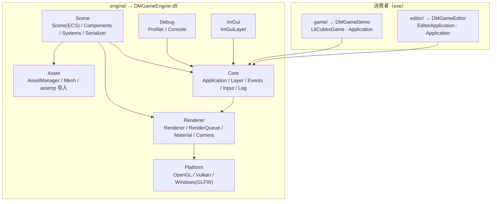
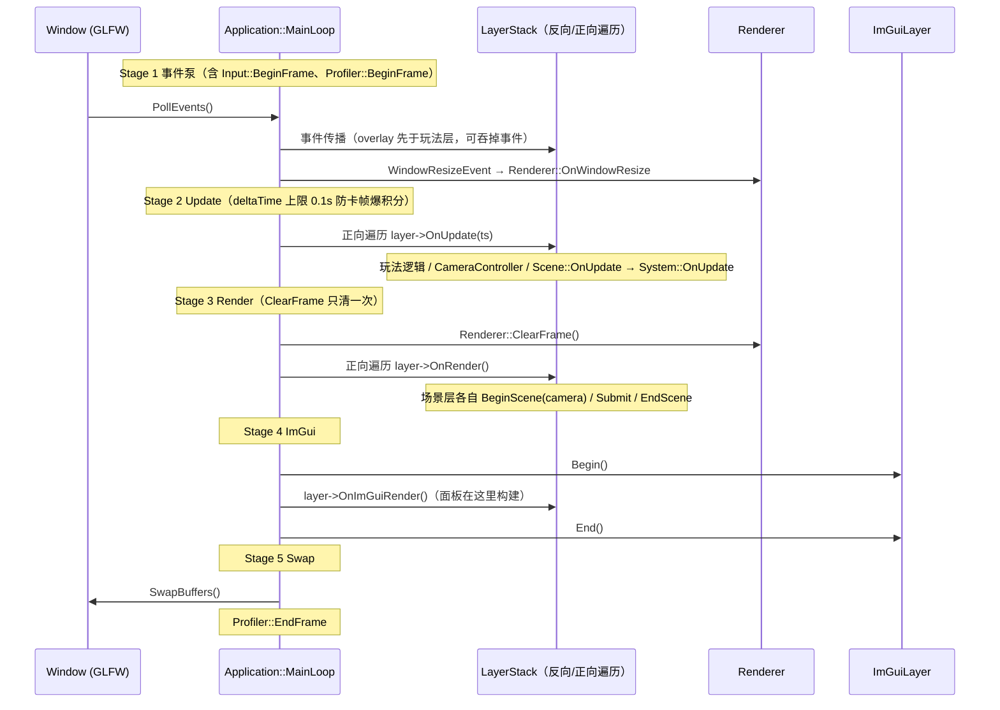
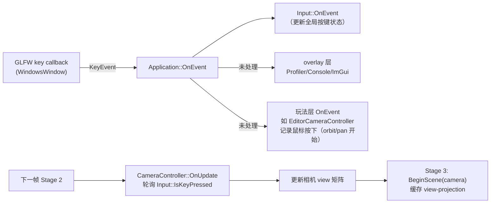
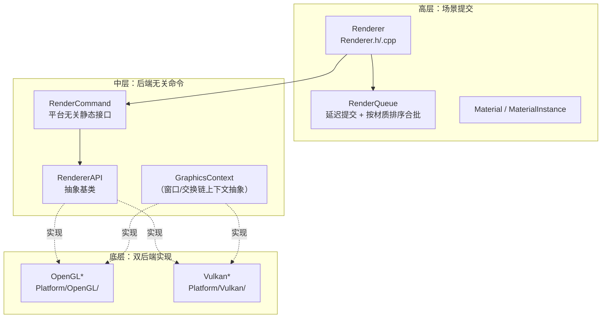

# Architecture Overview — 模块图与一帧的生命周期

> 目标：读完本文，你能在代码里找到每个子系统的入口文件，并理解"一帧"从事件到像素的完整流转。
> 所有路径、类名、函数名均对照代码核验过（2026-10，分支 `docs/guide-foundation`）。
> 设计决策的来龙去脉见 `documents/` 根下的工程档案（ECS_DESIGN / SCENE_DESIGN / ASSET_DESIGN 等），本文只做转述。

## 1. 总体分层

DMGameEngine 是一个学习型 C++23 游戏引擎（参考 TheCherno 的 Hazel 系列）。引擎本体编为 DLL（`DMGE_BUILD_SHARED=ON`，公共 API 用 `DMGE_API` 导出），两个消费者：`game/`（DMGameDemo，玩法视角检验）和 `editor/`（DMGameEditor，Unity 风格 ImGui 编辑器）。

公共 API 的唯一总入口是 `engine/src/DMGameEngine/DMGameEngine.h`——游戏工程 include 这一个头就能拿到全部引擎 API；`main()` 则由 `Core/EntryPoint.h` 提供（游戏只实现 `CreateApplication()` 工厂函数）。

## 2. 一帧的生命周期（主循环五阶段）

主循环在 `Application::MainLoop()`（`engine/src/DMGameEngine/Core/Application.cpp`），明确分为五个阶段，每段都有 `DMGE_PROFILE_SCOPE` 打点供 Profiler 采集：

要点（均可对照 `Application.cpp` 的 `MainLoop()` 注释与实现核验）：

1. **事件泵先行**（Stage 1）：OS 事件经 `Window::PollEvents()` 拉入，回调到 `Application::OnEvent(e)`：先喂给 `Input` 全局状态，`WindowResizeEvent` 在层传播前就被派发（层无法吞掉），然后事件沿 LayerStack **反向**传播——overlay（UI/工具）先消费输入，玩法层后拿到；最后兜底 `WindowCloseEvent → Quit()`。
2. **Update 正向遍历**（Stage 2）：LayerStack 正向遍历 `OnUpdate(ts)`，即先注册的层先 tick。`Timestep` 的 delta 被钳制在 0.1s，防止窗口拖拽/断点暂停产生巨大步长。
3. **Render 不归主循环管相机**（Stage 3）：`Renderer::ClearFrame()` 每帧只清一次 color+depth；每个场景层**自己**用 `BeginScene(camera)` / `EndScene()` 括出渲染 pass——一帧可以跑多个相机 pass（这正是编辑器 viewport RTT 的基础）。
4. **ImGui 独立阶段**（Stage 4）：`ImGuiLayer` 被自动作为 overlay 挂载（`Application::Initialize()`），所有层的 `OnImGuiRender()` 在 Begin/End 之间调用。
5. **自动挂载的调试覆盖层**：`ProfilerLayer`（F1 开关）、`ConsoleLayer`（` 键开关）在 `Initialize()` 里自动 Push，应用无需自己挂。

### 事件 → Update → 渲染 → 层叠 的完整链路

以"按 W 前进"为例：

注意引擎里**连续输入走轮询、离散输入走事件**的两条路：`Input::IsKeyPressed()` 是每帧轮询（`Input.h`，需在帧首调 `Input::BeginFrame()` 做边沿检测）；按键点击/滚动等离散事件才经事件系统分发。

### Layer（层叠模型）

- `Layer` / `LayerStack`（`Core/Layer.h`、`Core/LayerStack.h`）：`PushLayer` 进层列表，`PushOverlay` 进覆盖区；事件反向传播（overlay 先吃），Update/Render 正向遍历。
- `DefaultSceneLayer`（`Scene/DefaultSceneLayer.h`）：推荐的玩法层基类——持有 `CameraController` + 可选 `Scene`，`OnRender()` 里括出 `BeginScene(camera) → OnSceneRender() → EndScene()`，相机归层所有，主循环不持有全局相机。

## 3. 渲染子系统

### 三层抽象

- **Renderer**（`Renderer/Renderer.h`）：高层门面。`BeginScene(camera, target)` 缓存 view-projection 并重置 per-pass 队列；`Submit(material, vertexArray, transform)` 只是把绘制请求**入队**；`EndScene()` 触发 `Flush()`。
- **RenderQueue**（`Renderer/RenderQueue.h`）：延迟提交核心。Flush 时按 Material/Shader 排序分组——**每个 Material 组**（分组键是 Material 对象指针，含各 `MaterialInstance`）只在组内首个 draw 绑定一次材质，并随该次绑定上传一次 view-projection 与整套光照 uniforms；两个共享同一 Shader 的不同 `MaterialInstance` 会**各自**绑定与上传。大组还支持 `DrawIndexedInstanced` 实例化路径（见 `MeshRenderSystem` 的 `kInstancingThreshold` 双路逻辑）。
- **RenderCommand / RendererAPI**：低层 GPU 命令（clear、viewport、blend/depth/cull、DrawIndexed）由 `RenderCommand` 持有的 `RendererAPI` 后端实例执行；Renderer 自己不直接持有后端。

### Material（材质）

`Renderer/Material.h`：Material = Shader + 命名 uniform 值集合 + 纹理槽（sampler 名 → 纹理 + unit）。`Bind()` 一次上传全部。`MaterialInstance` 引用一个共享 base Material，叠加自己的 override——1500 个立方体共享一个 `MaterialInstance` 就是靠这个（`game/src/main.cpp`）。纯抽象层实现，无后端子类。

### 离屏 RTT（render-to-texture）

`Renderer/FrameBuffer.h`：`FramebufferSpecification` 里 `SwapChainTarget=false` 即离屏目标；`Renderer::BeginScene(camera, offscreenFB)` 把绘制重定向进 FrameBuffer。两个实际用途已落地：

1. **编辑器 Viewport**：`editor/src/EditorScene.cpp` 创建离屏 FB，`Renderer::BeginScene(m_Camera->GetCamera(), m_FB)` 渲入，`EditorLayer` 再用 `GetColorAttachment(0)->GetRendererID()` 作为 ImGui 贴图显示。
2. **相机自带渲染目标**：`Camera::GetRenderTarget()`（`Renderer/Camera.h`）返回非空时，`BeginScene(camera)` 自动渲到该目标——为阴影贴图 / 后处理 / 多视口预留。

### 双后端

- **OpenGL**（`Platform/OpenGL/`，默认）：`OpenGLRendererAPI`、`OpenGLFrameBuffer`、`OpenGLShader`、`OpenGLTexture2D/Cube/2DArray`、`OpenGLVertexArray/Buffer`、`OpenGLGraphicsContext`。
- **Vulkan**（`Platform/Vulkan/`，`-DDMGE_VULKAN_BACKEND=ON`）：对应一套 `Vulkan*` 实现 + `VulkanDevice/Swapchain`。
- 两个消费者（game/editor）的 `main.cpp` 都显式 `Renderer::SetAPI(Renderer::API::OpenGL)`。红线 R5：新抽象必须后端无关，禁止 GL 心智模型渗入公共接口（kb/KB-03）。

### 光照

`Renderer/Light.h`：纯数据结构（`DirectionalLightData` / `PointLightData` / `SpotLightData` / 聚合的 `SceneLightData`），上限 `MAX_POINT_LIGHTS=16`、`MAX_SPOT_LIGHTS=8`（per-name uniform 上传，尚未用 UBO）。首个方向光兼作环境光来源；数据由 `LightSystem` 在 `OnRender` 收集、`Renderer::SubmitLightData` 上传、`RenderQueue::Flush` 消费。shader 为 forward Blinn-Phong（`engine/shaders/BlinnPhong.glsl`、`BlinnPhongInstanced.glsl`）。

## 4. 场景与 ECS

核心在 `Scene/Scene.h`（引擎第一个引入 `<entt/entt.hpp>` 的头）：

- **Entity** = `uint32_t` 别名，在边界处与 `entt::entity` 互转。
- **Component 是纯数据**（红线 R4）：`Scene/Components/` 下现有 6 个——`IDComponent`、`TagComponent`、`TransformComponent`（左孩子/右兄弟层级链 + Dirty 标记）、`MeshComponent`、`CameraComponent`、`LightComponent`；聚合入口 `Components.h`。
- **System 是纯逻辑**：`Scene/Systems/System.h` 基类持 `Scene&`，子类覆盖 `OnUpdate/OnRender/OnEvent`。现有 3 个 System（注册顺序即执行顺序）：
  - `TransformSystem` — 先跑，按拓扑序重算 WorldMatrix（脏标记沿子树传播）
  - `LightSystem` — 收集 `SceneLightData`
  - `MeshRenderSystem` — 按 (Material, Mesh) 分组提交绘制，大组走实例化
- `Scene::OnUpdate(ts)` 依次 tick 各 System；`Scene::OnRender()` 调各 System 的 `OnRender`——但 **Scene 不括 render pass**，BeginScene/EndScene 归持有相机的 Layer（方案 A，见 ECS_DESIGN §10）。
- **序列化**：`SceneSerializer`（`Scene/SceneSerializer.h`）`Save/Load` 到 `.scene` JSON（nlohmann/json 是 PRIVATE 依赖，不外泄）。Load 用两趟重建：先建全部实体（UUID→Entity 映射），再按序列化 UUID 重挂父子——运行时 Entity ID 每次加载都会变。

## 5. 资产系统（Asset/）

`Asset/AssetManager.h`：单例，**按 AssetUUID 而非路径**统一加载与去重，三张表：

| 表 | 内容 |
|---|---|
| `m_Registry` | UUID → AssetMetadata（路径、类型、依赖） |
| `m_PathToUUID` | 路径 → UUID 反查 |
| `m_Cache` | UUID → `weak_ptr`（已加载 `Ref<T>`，无人引用自动释放） |

- `Load<T>(uuid)`：缓存命中直接返回（同一 UUID 永远拿到同一个 `Ref<T>`）；未命中则解析路径 + 类型校验 + `AssetLoader<T>::Load`。
- `Register/LoadRegistry/SaveRegistry`：UUID↔路径映射持久化为 JSON，保证序列化里的 UUID 引用跨启动仍有效。
- 当前为**同步加载**；异步/热重载是完整版规划（ASSET_DESIGN §10）。
- Mesh 导入：`Asset/MeshImporterAssimp.cpp`（assimp），含 `SubMesh` 拆分。

## 6. 调试与编辑器工具

- **Profiler**（`Debug/Profiler.h`）：`BeginFrame/EndFrame` 括帧，`DMGE_PROFILE_SCOPE("...")` 打点；`ProfilerLayer`（F1 开关）显示平滑 FPS、滚动帧时间图、逐 scope 的 count/total/mean/min/max 表。
- **Console**（`Debug/Console.h`）：开发者控制台覆盖层（` 键开关）。
- **ImGuiLayer**（`ImGui/ImGuiLayer.h`）：引擎侧编译并**导出** ImGui 符号（`IMGUI_API=dllexport`），编辑器侧 dllimport 复用同一份 context——红线 R7，禁止编辑器再链一份 ImGui。
- **编辑器**（`editor/src/`）：`EditorApplication`（Application 子类）+ `EditorLayer`（dockspace、菜单、Viewport RTT 显示、Hierarchy/Inspector/Systems/AssetBrowser 面板、ImGuizmo gizmo：1/2/3/4 切换平移/旋转/缩放/关闭）+ `EditorScene`（离屏 FB + EditorCameraController + play 标志）+ `LogPanel`。

## 7. 深入阅读路径

1. `Core/Application.cpp` 的 `MainLoop()` —— 一帧五阶段的真实实现
2. `Renderer/Renderer.h` + `Renderer/RenderQueue.h` —— 延迟提交与合批
3. `Scene/Scene.h` + `Scene/Systems/*.h` —— ECS 的最小闭环
4. `editor/src/EditorLayer.cpp` —— 所有子系统如何被一个真实消费者组合起来
5. 工程档案：`ECS_DESIGN.md`、`SCENE_DESIGN.md`、`ASSET_DESIGN.md`、`ASSET_UUID_CONCEPTS.md`、`PRECOMPILED_HEADER.md`（均在 `documents/` 根，只增不毁的历史档案）
