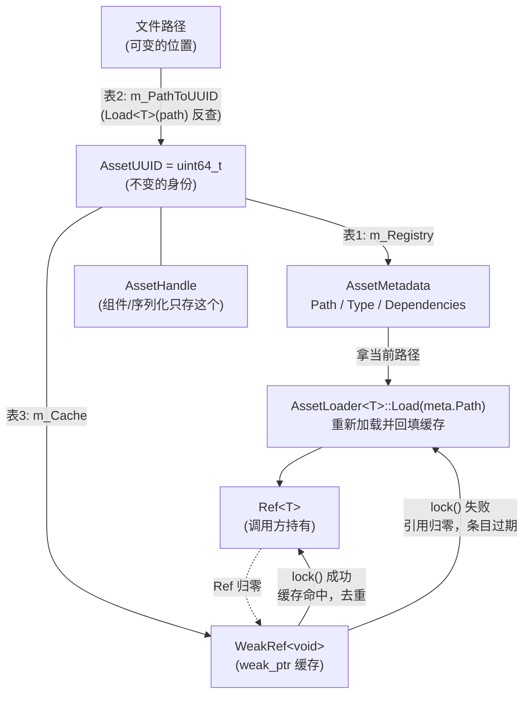

# 资产系统导览（Asset Tour）

> 目标：读完本文，你能说清资产为什么用 UUID 做身份而不是路径、`AssetManager` 三张表各管什么、`Load<T>` 的一次完整流程、`AssetLoader<T>` 特化机制与跨 DLL 导出的坑、assimp 导入管线（静态网格 + 骨骼/动画阶段 1 的派生路径）、`.mat` 材质格式与 `registry.json` 持久化，以及当前版本的已知局限。
> 本文所有路径、类名、格式字段均对照代码核验（写作时点：2026-10，`docs/asset-tour` 分支快照）。文中不引用行号——代码会演进，用类名/函数名定位。
> 更深的档案**不在本文复制**：设计沿革见 `documents/ASSET_DESIGN.md`（1a 最小版 → UUID 方案的演进记录），UUID 概念详解见 `documents/ASSET_UUID_CONCEPTS.md`，Agent 向约定与避坑见 `kb/KB-05-资产系统约定.md`。

## 1. 一句话设计核心：身份与路径分离

资产代码都在 `engine/src/DMGameEngine/Asset/`。整套系统只回答一个问题：**"场景文件里引用的这个资源，跨启动、跨移动之后还能找回来吗？"**

答案是把两件事拆开：

- **身份**（你是谁）——`AssetUUID`，64 位随机数，终身不变；
- **位置**（你在哪）——文件路径，随时可变，只存在元数据里。

两个核心类型（都在 `Asset/AssetTypes.h` 与 `Asset/AssetHandle.h`）：

```cpp
using AssetUUID = uint64_t;          // 学习级 64 位（mt19937_64 随机生成）；
constexpr AssetUUID NullUUID = 0;    // 生产级用 128 位（见 ASSET_UUID_CONCEPTS 第六部分）

class AssetHandle
{
    AssetUUID m_UUID = NullUUID;     // 只存 UUID，不存路径！
public:
    AssetUUID GetUUID() const;
    bool IsValid() const;            // UUID != 0
};
```

`AssetHandle` 是**纯粹的身份令牌**：不持指针、不持路径、不持引用计数。组件（如 `MeshComponent::MeshAsset`、`AnimatorComponent::SkeletonAsset`）和序列化文件里一律存它。路径要用时经 `AssetManager::GetMetadata(uuid)->Path` 查表得到。资源文件移动后只需更新元数据里的路径，UUID 不变，所有引用照常有效——这就是"身份/路径分离"的全部收益。

`AssetType` 枚举（`AssetTypes.h`）当前有：`Shader / Texture2D / TextureCube / Texture2DArray / Material / Mesh / Audio / Skeleton / AnimationClip`（后两者在 `DMGE_ANIMATION` 编译开关下使用）。每个 C++ 资源类型经 `AssetTypeOf<T>()` 特化映射到枚举值，供 `Load` 时做类型校验。

**为什么这套东西存在**：早期 1a 最小版用路径做资产身份（`AssetHandle` 存 `std::string`），资源一移动引用全断。UUID 方案（ASSET_DESIGN §12 推荐的"方案 B 集中 registry"）在 1c 序列化落地前升级完成，让场景文件从第一次起就存 UUID，避免"先存路径后返工"。

## 2. AssetManager：三张表 + Load 流程

`Asset/AssetManager.h/.cpp`，导出类（`DMGE_API`），Meyers 单例（`AssetManager::Get()`）。它的全部状态就是三张 `unordered_map`：

| 表 | 成员 | 键 → 值 | 职责 |
|---|---|---|---|
| 表 1 注册表 | `m_Registry` | `AssetUUID` → `AssetMetadata` | 身份查元数据（路径、类型、依赖） |
| 表 2 反查表 | `m_PathToUUID` | 路径 → `AssetUUID` | 按路径加载时反查身份 |
| 表 3 缓存 | `m_Cache` | `AssetUUID` → `DM::WeakRef<void>` | 已加载对象的去重与自动释放 |

`AssetMetadata`（`AssetTypes.h`）= `UUID + Path（可变）+ Type + Dependencies（vector<AssetUUID>）`。`Dependencies` 目前只在 registry JSON 里往返保存，是将来"Material 依赖 Shader/纹理失效传播"的基础设施。

### 2.1 一次 Load 的完整旅程

`Load<T>(uuid)`（主入口，序列化反序列化走它）按顺序做四件事：

1. **查缓存**：表 3 里 `weak_ptr::lock()` 成功 → `static_pointer_cast<T>` 直接返回。**同一 UUID 永远返回同一个对象**——这是去重的含义。lock 失败（引用已归零）→ 删除过期条目，继续。
2. **查元数据**：表 1 里找不到 UUID → 返回 `nullptr`；找到但 `meta.Type != AssetTypeOf<T>()` → 类型不匹配，返回 `nullptr`（不会发生"把 .png 当 Mesh 加载"）。
3. **真正加载**：调 `AssetLoader<T>::Load(meta.Path)`（见 §3）。
4. **入缓存**：成功则以 `weak_ptr` 存入表 3 并返回 `Ref<T>`。

两个便捷重载共用这条管道：

- `Load<T>(const AssetHandle&)`：取 handle 的 UUID，等价于按 UUID 加载。
- `Load<T>(const std::string& path)`：表 2 反查 UUID；**查不到会顺手 `Register`**（自动分配身份并登记）再加载。这让"随手加载"很方便，但要注意：这样注册的资产身份是运行期临时分配的，除非 `SaveRegistry` 落盘，重启后会变。



一句话读图：**路径只是入口，UUID 才是主干，缓存挂在 UUID 下面**。组件和场景文件永远只和 `AssetHandle`（UUID）打交道；路径在导入/注册时出现一次，之后只在表 1 的元数据里更新。

### 2.2 注册、查询与清理

- `Register(path, type)`：分配 UUID + 双写表 1/表 2。**按路径幂等**——同一路径重复注册返回已有 UUID。assimp 导入器注册材质、`Load<T>(path)` 陌生路径都走它。
- `GetUUID(path)` / `GetMetadata(uuid)`：两张表的只读查询。`GetMetadata` 返回 `const AssetMetadata*`，编辑器导出工程（`editor/src/ProjectExporter.cpp`）就用它把 UUID 还原成文件路径做资产拷贝。
- `CleanUnused()`：清理表 3 里已过期的 `weak_ptr` 条目（表 1/表 2 不清——身份映射与"是否加载过"无关）。
- `Clear()`：三表全清（测试与场景重置用）。

**weak_ptr 缓存的语义值得停下想一下**：谁负责让资产"活着"？答案是没有中央管理者——只要有任何调用方持有 `Ref<T>`，缓存条目就有效；最后一个持有者释放后，资产自动析构，条目变成待清理的过期 weak_ptr。这换来零手动释放，但也意味着：**组件里存裸 `Ref<Mesh>` 而不是 `AssetHandle` 会绕过去重缓存**（kb/KB-05 规则 1 明令禁止），且两次独立加载之间不保证对象地址稳定（除非缓存持有强引用——当前没有）。

## 3. AssetLoader<T>：每类型一个特化

`Asset/AssetLoader.h` 声明主模板（**必须特化**，主模板无定义体可用）：

```cpp
template<typename T> struct AssetLoader;   // 未特化的类型直接编译报错
```

每种资源类型特化一个 `static Ref<T> Load(const std::string& path)`。当前全部特化及其实现位置：

| 特化 | 实现位置 | 说明 |
|---|---|---|
| `AssetLoader<Shader>` | 头文件内联 | 委托 `Shader::Create(path)` 工厂 |
| `AssetLoader<Texture2D>` | 头文件内联 | 委托 `Texture2D::Create(path)` 工厂 |
| `AssetLoader<Material>` | `AssetLoader.cpp`（`DMGE_API` 导出） | 读 `.mat` JSON，见 §5 |
| `AssetLoader<VertexArray>` | `AssetLoader.cpp`（`DMGE_API` 导出） | 读 `.mesh` JSON → VB/IB（学习用手写网格格式） |
| `AssetLoader<Mesh>` | `AssetLoader.cpp`（`DMGE_API` 导出） | 按扩展名分发：`.mesh` → JSON；`.fbx/.obj/.gltf/.glb` → assimp（见 §4） |
| `AssetLoader<Skeleton>` | `Animation/AnimationAssetLoaders.cpp`（`DMGE_API` 导出） | `DMGE_ANIMATION` 开关下编译；按派生路径/`.skel.json` 分发 |
| `AssetLoader<AnimationClip>` | 同上（`DMGE_API` 导出） | 同上，`.anim.json` 分支 |

nlohmann/json 的依赖被关在各实现 .cpp 里（头文件不泄漏 json 头）。

### 3.1 为什么特化要标 DMGE_API——K-002 的教训

模板特化是"每个使用它的编译单元各实例化一份"。DLL 内的 `AssetManager::Load<T>` 和 exe 里的调用点会**各自实例化** `AssetLoader<T>`——exe 侧的实例需要看到完整定义；而 `AssetLoader<Material>` 这类把实现放在 DLL 的 .cpp 里的特化，exe 侧实例化时找不到函数体，链接期直接 `LNK2019`。

这正是 kb/KB-07 **K-002** 记录的事故：编辑器 exe 调 `AssetManager::Load<Material>` 链接失败。两条出路：

1. 特化显式实例化并导出——**给特化结构体标 `DMGE_API`**（上表所有放 .cpp 实现的特化都这么做了）；
2. 或者消费者走 DLL 内的门面接口，不直接碰模板。

规律：**新增"实现放 .cpp"的 `AssetLoader` 特化，特化声明处必须标 `DMGE_API`**，否则跨 DLL 消费者（编辑器、游戏 exe、头文件内联的 System）必炸链接。`Skeleton`/`AnimationClip` 特化就是为让 header-only 的 `AnimationSystem` 能在任何编译单元调 `Load<Skeleton>` 而导出的。

## 4. assimp 导入管线

assimp 的依赖被完整关在 `Asset/MeshImporterAssimp.cpp` 这一个翻译单元里（不是公共 API；`AssetLoader.cpp` 与动画加载器各通过一个自由函数入口调用它）。支持 `.fbx / .obj / .gltf / .glb`。

### 4.1 静态网格路径（无骨骼时）

`LoadMeshViaAssimp(path)` 的流水线：

1. **读取**：assimp `Importer::ReadFile`，后处理 flags = `Triangulate | GenSmoothNormals | JoinIdenticalVertices | CalcTangentSpace | ValidateDataStructure`。**没有 `FlipUVs`**——UV 翻转交给 GL 纹理加载器统一处理（两边各让一步，见头文件注释）。
2. **通道探测**（`DetectChannels`）：扫描所有 aiMesh，收集 Normal / TexCoords / Tangent 是否存在（骨骼见下节）。
3. **超集布局**（`BuildLayout`）：整个 Mesh 用**一个** BufferLayout，是所有 aiMesh 出现过的通道的并集，顺序固定（Position 必有，其余按需）；某个 aiMesh 缺某通道就零填充，保证 stride 一致。
4. **节点遍历**（`ProcessNode`）：递归走 aiNode 树，把每层变换**烘焙进顶点**（`bakeTransforms=true`）；所有 aiMesh 摊平进共享的顶点/索引缓冲，**每个 aiMesh 生成一个 `SubMesh`**（索引区间 + 材质 `AssetHandle`）。
5. **材质映射**：对每个 aiMaterial，在模型同目录找 `<材质名>.mat` 文件（名字经 `SanitizeMaterialName` 清洗，找不到用 `<模型名>_<索引>` 兜底）。找到 → `Register` 成 Material 资产并把 UUID 写进 SubMesh；找不到 → 记警告，`SubMesh::MaterialAsset` 保持无效（渲染侧跳过该 draw，直到补写 .mat）。

产物 `Mesh`（`Asset/Mesh.h`）持有：交错顶点数组 + 索引 + `SubMeshes`（材质分组）+ Layout；`GetVertexArray()` **惰性**上传 GPU 并缓存，把"解析文件"和"创建 GPU 资源"解耦。

### 4.2 骨骼/动画阶段 1（DMGE_ANIMATION 开关）

`DMGE_ANIMATION` 编译开关打开后（引擎 CMake option，默认 OFF），带 `aiBones` 的模型走皮肤化路径：

- **顶点不烘焙节点变换**（`bakeTransforms=false`）：皮肤化调色板是相对绑定姿态定义的，顶点保留网格局部空间（阶段 1 假定网格节点全局变换为单位阵，标准皮肤化模型成立）。布局追加 `Float4 a_BoneIndices + Float4 a_BoneWeights`——每顶点取权重最高的 4 根骨骼、归一化，索引按 float 存（保证交错缓冲纯 float，shader 里转 ivec4）。
- **骨架重建**：收集所有 aiBone（按首次出现顺序），经节点层级解析父子关系，**重排为"父在子前"**（`ReorderParentsFirst`，正向传播动画的前置不变量），产出 `Skeleton`（关节名、父索引、逆绑定矩阵）。
- **动画剪辑**：每个 `aiAnimation` 转成一个 `AnimationClip`（平移/旋转/缩放关键帧通道；目标节点不是关节的通道被跳过——阶段 1 不做无骨骼的节点动画）。
- **派生路径注册**（本节重点）：骨架与剪辑**不写成文件**，而是作为虚拟路径注册进 AssetManager：

```
<模型文件>#skeleton        -> AssetType::Skeleton
<模型文件>#anim/<序号>      -> AssetType::AnimationClip（每个 aiAnimation 一条）
```

这是"身份/路径分离"的一次妙用：UUID 身份照常分配、可序列化引用，而"路径"扩展成了"模型文件 + 选择子"。之后 `AssetLoader<Skeleton>` 看到带 `#skeleton` 后缀的路径就走 `LoadSkeletonViaAssimp` 重新导入模型取骨架，`#anim/<i>` 同理取第 i 条剪辑——**数据是惰性加载的**，导入 Mesh 时只登记身份不构建骨架数据。手写资产也可以绕开 assimp，直接用 `.skel.json` / `.anim.json` 极简 JSON 格式（测试资产用，字段见 `AnimationAssetLoaders.cpp` 头注释）。

消费侧：`AnimatorComponent`（`Scene/Components/AnimatorComponent.h`）按 `AssetHandle` 引用骨架与剪辑列表，`AnimationSystem` 每帧经 AssetManager 惰性加载并采样出蒙皮矩阵 Palette。

## 5. `.mat` 材质格式

`AssetLoader<Material>`（`AssetLoader.cpp`）读 JSON，三个顶层字段：

```json
{
  "shader": "assets/shaders/flat.glsl",
  "uniforms": {
    "u_Color": { "type": "Float4", "value": [1.0, 0.5, 0.5, 1.0] }
  },
  "textures": {
    "u_DiffuseTexture": { "path": "assets/textures/wood.png", "slot": 0 }
  }
}
```

加载流程：`shader` 字段经 `AssetManager::Load<Shader>` 去重加载 → 直接构造 `Material(shader)`（Material 没有 Create 工厂）→ `uniforms` 逐项经 `UniformSerializer.h` 的 `ApplyUniform` 按 `type` 标签分发到对应 `Material::Set*`（支持 Int/Float/Float2-4/Mat4/IntArray）→ `textures` 逐项经 `Load<Texture2D>` 加载并 `SetTexture(采样器名, 纹理, slot)`。

两个值得注意的设计：**shader 与纹理都走 AssetManager**，所以材质的依赖天然去重、可追踪（`Dependencies` 字段为此预留）；**`ApplyUniform` 是共享代码路径**——`.mat` 加载与场景文件里的 MaterialOverride 反序列化用同一套 `{type, value}` 形状，不会出现两处格式漂移。

## 6. registry.json：身份映射的持久化

UUID 与路径的映射存在内存三表里，进程退出就没了——场景文件里存的 UUID 重启后会变成孤儿。`LoadRegistry(path)` / `SaveRegistry(path)` 解决这件事，格式：

```json
{
  "17192345678901234567": {
    "path": "assets/meshes/cube.mesh",
    "type": 6,
    "deps": []
  }
}
```

键是 UUID 的十进制字符串，`type` 是 `AssetType` 枚举的整数序号（`Mesh` = 6）。`LoadRegistry` 逐条重建表 1/表 2（解析失败的条目跳过；路径冲突时**先注册者获胜**）。典型使用姿势是编辑器保存时 `SaveRegistry`、启动时 `LoadRegistry`。

注意现状：目前这对接口**只有单测在用**（`engine/tests/test_asset.cpp` 做往返验证），编辑器/游戏还没有接上启动加载/退出保存的固定流程——在接入前，"跨启动 UUID 稳定"依赖手工调用。

## 7. 已知局限（动手前先读）

| 局限 | 现状 | 去向 |
|---|---|---|
| **同步加载** | `Load<T>` 阻塞当前线程完成解析 + GPU 上传 | 异步加载在 ASSET_DESIGN §10 完整版规划（LoadAsync + Job System + 主线程上传） |
| **无热重载** | 文件改动无监听，改了要重载场景 | 规划挂 mtime 监听 + UUID 失效传播（依赖 `Dependencies` 字段） |
| **程序化网格没有身份** | 运行期 `Ref<Mesh>` 不经 `Register`/loader 就无法序列化——JSON 往返会静默丢网格 | kb/KB-07 **K-012**；Play 快照/Prefab 因此走 `editor/src/SceneDuplicator` 按值拷贝而非序列化往返 |
| **GPU 延迟释放缺失** | `Ref` 归零即析构，不等"帧在飞" | 延迟释放队列对齐 Vulkan deletion queue（KB-05 规则 3，新增 GPU 持有型资产类型时必须考虑） |
| **`Dependencies` 尚未用于加载** | 字段与 registry 往返已就绪，但加载不会自动拉依赖 | 材质依赖追踪是热重载/失效传播的前置 |

另有一条**对消费者立刻相关的约束**：不要在组件里存文件路径字符串或裸 `Ref<>` 引用资产——前者移动资源就断，后者绕过去重缓存、破坏生命周期管理（kb/KB-05 规则 1）。一律 `AssetHandle`。

## 8. 读代码顺序建议

1. `Asset/AssetTypes.h` → `Asset/AssetHandle.h`：身份模型，60 行读完。
2. `Asset/AssetManager.h`：三表 + `Load<T>(uuid)` 模板全在头文件注释和实现里，对着 §2.1 的流程读。
3. `Asset/AssetLoader.h`：特化地图，再按兴趣跳 `AssetLoader.cpp`（Material/.mat、Mesh 分发）或 `Animation/AnimationAssetLoaders.cpp`（派生路径分发）。
4. `Asset/MeshImporterAssimp.cpp`：只读头注释块 + `LoadMeshViaAssimp` 主体即可，皮肤化细节按需。
5. `engine/tests/test_asset.cpp` 与 `test_assimp_import.cpp`：把测试当用法示例——`Load` 去重、`Register` 幂等、registry 往返都有可运行断言（用例数随任务增长，以构建产物为准）。

## 9. 深入阅读

- 设计与演进：`documents/ASSET_DESIGN.md`（含 §12 UUID 方案补充章节）、`documents/ASSET_UUID_CONCEPTS.md`（三表/持久化三方案/完整工作流的概念详解）。
- Agent 向约定与坑：`kb/KB-05-资产系统约定.md`、`kb/KB-07-已知问题与陷阱清单.md`（K-002 模板特化导出、K-012 程序化网格）。
- 消费方视角：[SceneAndECSTour.md](SceneAndECSTour.md)（MeshComponent / 序列化如何引用资产）、[EditorTour.md](EditorTour.md)（拖拽加载、导出工程的资产拷贝）、[LearningPath.md](LearningPath.md) 站⑥。
