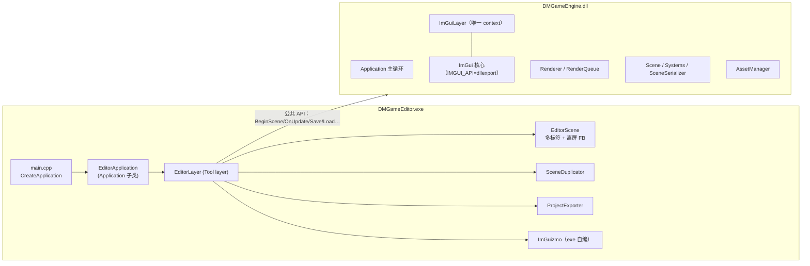
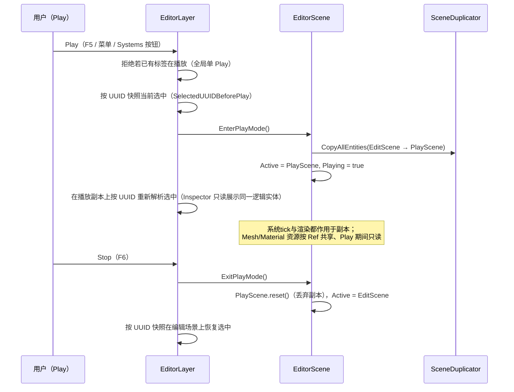

# 编辑器导览（Editor Tour）

> 本文展开 [LearningPath.md](LearningPath.md) 站 ⑦：编辑器如何作为**引擎 DLL 的消费者**工作，多标签场景、Play 快照隔离、资产拖拽、Prefab、导出可运行工程，以及几个踩过实测的坑。
> 所有路径、类名、数字均对照代码核验（写作时点：2026-10，`docs/tours` 分支，基于 develop `fba9955` 快照）。不引用行号。
> 编辑器自身的路线图与设计档案：`editor/EDITOR_ROADMAP.md`（架构决策 §2、数据流 §3.2）；已知坑：`kb/KB-07`（K-007 / K-012 / K-015 / K-016 / K-017 / K-018）。

## 1. 架构：独立 exe，消费引擎 DLL

编辑器不是引擎的子模块，而是一个普通的消费者 exe：

- `editor/CMakeLists.txt`：`add_executable(DMGameEditor ...)` + `target_link_libraries(DMGameEditor PRIVATE DMGameEngine)`；POST_BUILD 把 `DMGameEngine.dll` 拷到编辑器运行目录。
- 编辑器只 `#include <DMGameEngine/DMGameEngine.h>`，通过公共 API 操作 ECS/序列化/资产/渲染——`EditorLayer` 的 `OnImGuiRender` 因此可以当**全引擎 API 的消费清单**来读。
- 启动链与 game 完全同构：`editor/src/main.cpp` 的 `CreateApplication()` 里 `Renderer::SetAPI(OpenGL)` → `new EditorApplication()`（1600x900 窗口，`PushLayer(EditorLayer)`）。

**最关键的一条：ImGui 跨 DLL 单 context**（`editor/EDITOR_ROADMAP.md` §2.2，整个方案里最难的问题）。ImGui 用全局 `GImGui` 持有当前 context——exe 和 DLL 若各编译一份 ImGui 源码，就有两个 `GImGui`，面板不显示或崩溃。落地方式是**只编译一份、定向导出**：引擎侧编译 5 个 ImGui 核心源时加 `IMGUI_API=__declspec(dllexport)`，编辑器侧 `target_compile_definitions(DMGameEditor PRIVATE "IMGUI_API=__declspec(dllimport)")` 并 include 引擎的 imgui 头。全量导出（`WINDOWS_EXPORT_ALL_SYMBOLS`）试过、死于 shaderc/glslang 静态库 PCH 符号冲突——这也是"红线 R7：编辑器不得再链一份 ImGui"的由来。gizmo 用的 ImGuizmo 则是编辑器自带的（`editor/dependencies/ImGuizmo`，纯头式源码直接编进 exe）。



## 2. 两层职责：EditorLayer（UI）与 EditorScene（状态）

- `editor/src/EditorLayer.h/.cpp`：唯一的 `Layer`（`LayerType::Tool`），持有**全部面板逻辑**。`OnImGuiRender()` 的调用序就是面板清单：`ImGuizmo::BeginFrame` → 模态对话框 → Dockspace → 菜单栏 → 场景标签 → Viewport → Hierarchy → Inspector → Systems → Asset Browser → Log。
- `editor/src/EditorScene.h/.cpp`：**所有打开的场景标签 + 一个共享离屏 FB**。每帧 `OnUpdate`（tick 各播放中的场景）与 `Render`（只渲染活动标签）。
- `EditorApplication.cpp` 只做窗口 + push layer，薄得不用读。

### 2.1 默认布局与面板一览

首次启动由 `DockBuilder` 搭出 Unity 风格布局（此后 ImGui 持久化到 `imgui.ini`，可随意重排）：

| 面板 | 位置 | 内容 |
|---|---|---|
| **Scenes** | 顶部细条 | 场景标签页；`Dirty` 加 `*`，播放中加 `(Playing)`；标签上的 x 关闭（脏场景弹确认） |
| **Scene Hierarchy** | 左 | 沿三叉链从根递归画实体树；点空白处取消选中；右键实体弹 Prefab 菜单 |
| **Inspector** | 右 | 选中实体的组件编辑（Tag/UUID/Transform/Camera/Light/Mesh）+ Add/Remove Component |
| **Systems** | 右（与 Inspector 同列） | 只读列出 `Scene::GetSystems()`（`System::GetName()`——这是引擎为编辑器开的"工具可见性"口子之一，`EDITOR_ROADMAP.md` §2.3）+ Play/Pause/Stop 按钮 |
| **Asset Browser** | 底 | 递归列 `editor/assets`、`engine/shaders`、`prefabs/`，带类型图标，可拖拽 |
| **Log** | 底（与 Asset Browser 同列） | `LogPanel`：挂在引擎 core + client logger 上的 spdlog sink，实时显示 `DMGE_LOG_*` 输出 |
| **Viewport** | 中央 | 离屏 FB 的颜色附件 + gizmo 工具条（按钮与 1/2/3/4 键）+ 点选 + 拖放目标 |

菜单栏 File：New Scene / Open Scene... / Save Scene / Save Scene As... / Recent Scenes（最多 8 条，存 `editor_config.ini`）/ Close Tab / Export Runnable Project...。打开与另存为走的是**编辑器内自绘的 ImGui 模态对话框**（`EditorLayer::Dialog` 状态机 + 单个 `EditorDialog` popup）——菜单项上标注的 "Ctrl+N/S/O" 文本并无对应的快捷键处理，操作入口就是菜单点击。

## 3. 多标签：SceneTab 与"全局单 Play"

`SceneTab`（`EditorScene.h`）每个标签完全独立：

- `EditScene`（权威编辑态）/ `PlayScene`（播放副本）/ `Active`（指向两者之一）；
- 独立 `EditorCameraController`、独立 `Selected` 选中实体、独立 `Playing/Paused`；
- `Name / Path / Dirty`（`Path` 为空 = 从未保存；`Name` 是文件名 stem 或 `Untitled-N`）。

**但 Play 是全局唯一的**（stage 3 多场景策略，`EditorScene.h` 头注释写明）：任一时刻至多一个标签处于播放态（`FindPlayingTab()`），像"启动了游戏"一样；再按别处的 Play 会被拒绝并提示先 Stop。两个配套语义：

1. **后台播放继续 tick**：播放中的标签即使不显示也每帧 `OnUpdate`（不可见模拟被静默暂停会在切回时出现不可预期的时间跳变，而一个不渲染的 ECS tick 很便宜）；切换标签从不触碰播放状态。
2. **只渲染活动标签**：所有标签共享**一个**离屏 FrameBuffer，只有活动标签画进它，也只有它的相机收输入。

播放控制入口有两处：**Play 菜单**（Pause/Resume 标注 "F5"、Stop 标注 "F6"——与 "Ctrl+N/S/O" 一样只是菜单标注文本，并无键盘处理）和 **Systems 面板的按钮**。entity 增删（Create Empty / Delete）与 Inspector 编辑在播放中都禁用（见 §4）。

## 4. Play 快照隔离：SceneDuplicator 深拷贝

语义与主流引擎一致：**Play 里的改动不保留**。流程（`EditorLayer::BeginPlay/EndPlay` + `EditorScene::EnterPlayMode/ExitPlayMode`）：



**为什么不用 `SceneSerializer` JSON 往返做快照**（`editor/src/SceneDuplicator.h` 文件头有完整论证；KB-07 **K-012**）：序列化按设计只存 `MeshComponent.MeshAsset` 的 UUID，而程序化网格（默认场景的 Cube，`EditorScene::MakeCubeMesh` 手工构造、未注册进 AssetManager）没有 UUID，JSON 往返后网格变 null、不渲染。所以用**按值拷贝组件 + 共享 `DM::Ref<Mesh>`/`Ref<MaterialInstance>` 资源**的深拷贝（`EditorSceneCopy::CopyAllEntities` / `CopyEntityTree`），完全保真；共享资源在 Play 期间视为只读。代价是编辑场景对象在播放期间原封不动——Stop 即恢复。

配套的只读细节：播放中 Inspector 整体 `BeginDisabled` 并显示黄色提示条；gizmo 只在编辑模式出现；实体创建/Prefab 实例化在播放中被拒绝。

一个容易忽略的实现细节：编辑模式的活动标签每帧以 `dt = 0` tick 一次 `Scene::OnUpdate`——纯粹为了让 `TransformSystem` 重算被 gizmo/点选改脏的 `WorldMatrix`（渲染和拾取都读它），不驱动任何时间相关行为。

## 5. Viewport：离屏 RTT、点选与 gizmo

`EditorScene::Render()` 的括号：`Renderer::BeginScene(camera, m_FB)` → `RenderCommand::SetViewport(FB 尺寸)`（Bind 不设 viewport，手动设）→ 活动 `Scene::OnRender()` → `EndScene`。`EditorLayer::DrawViewport()` 再把 `FB->GetColorAttachment(0)->GetRendererID()` 喂给 `ImGui::Image`（UV `(0,1)-(1,0)` 做 Y 翻转——GL 纹理原点在左下）。这就是"编辑器没有独立渲染路径"的实证：用的就是站 ③ 的 `Renderer`，只是换了 target。

相机控制不走引擎事件——`ImGuiLayer` 会截获 viewport 上的鼠标事件（`io.WantCaptureMouse`），所以 `DrawViewport` 直接读 ImGui 鼠标状态驱动 `EditorCameraController`：右键拖 orbit、中键拖 pan、滚轮 zoom；且仅当 `m_ViewportFocused && m_ViewportHovered` 时 `SetEnabled`。相机是轨道相机（绕 `Target`）。

**点选（picking）**：点击 viewport → 像素坐标归一化成 NDC → `inverse(viewProjection)` 在 near/far 两个面上取两点构造射线 → 遍历 `view<MeshComponent>`，把每个网格的**局部 AABB 8 角**用 `WorldMatrix` 变换到世界系做 `RayAABB` → 最近者选中。用到引擎侧的只有 `Camera::GetViewProjection()` 缓存与 `TransformComponent.WorldMatrix`。

**gizmo**：1 = Translate、2 = Rotate、3 = Scale、4 = 关（`m_GizmoType = -1`），与屏幕工具条按钮等效。`ImGuizmo::Manipulate` 解算后把结果**写回 local TRS**（`Translation/RotationEuler/Scale`，注意 `ImGuizmo` 给的是角度制要转弧度）并 `Dirty + MarkSubtreeDirty`——编辑器也遵守"改变换走标脏"的 Scene 契约。

### 5.1 坐标换算坑（K-007 与它的邻居）

- **K-007**（`editor/GIZMO_HITTEST_FIX.md`）：gizmo 曾画在 ForegroundDrawList 上——它不属于任何命名窗口，ImGuizmo 的命中检测（依赖 draw list 的所属窗口）永远失败，表现为"能点选但不能拖 gizmo"。修法：`ImGuizmo::SetDrawlist(ImGui::GetWindowDrawList())`，画在 Viewport 窗口自己的 draw list 上（顺带保证 gizmo 盖在画面之上）。
- 离屏 FB → ImGui Image 的 Y 翻转与缩放换算也出自同一次修复；新增拾取/拖拽交互前先读 `GIZMO_HITTEST_FIX.md`。
- **K-017**：`ImGui::GetContentRegionAvail()` 在 dock 布局未稳的首几帧可能返回**负值**，cast 成 `uint32` 变成 ~43 亿，躲过 `> 0` 守卫直接把 GL 的 `glTexStorage2D` 炸出断言。现行防御：先判 `1.0f ≤ avail ≤ 8192.0f` 再 cast 传给 `EditorScene::Resize`。
- **K-018**：vendored ImGui 的 GLFW WndProc 钩子需要空保护补丁（已在 `imgui_impl_glfw.cpp` 打了 `[DMGE patch]`）——升级 vendored ImGui 时要重新套用。

## 6. Asset 拖拽与 Prefab

### 6.1 拖拽：一个 payload，三个落点

Asset Browser 的每一行都是 `BeginDragDropSource`，payload 类型统一为 `"ASSET_PATH"`（完整路径字符串）。三个 `BeginDragDropTarget`：

1. **Viewport**：丢模型文件（`.fbx/.obj/.gltf/.glb/.mesh`）→ `CreateEntityFromModel`：`AssetManager::Load<Mesh>(path)` 新建实体（名字 = 文件 stem）、记 `MeshAsset UUID`（按路径加载会自动注册进 registry，所以能存能序列化）、按网格包围盒把 Scale 归一化到最大边约 2 单位（模型尺度差异可以很大）、赋默认 Blinn-Phong 材质（材质是编辑器现场构建的——`AssetLoader<Material>` 未导出，KB-07 **K-002**）。
2. **Scene Hierarchy**（整窗 drop target）：同上，创建为新根实体。
3. **Inspector 的 Mesh 组件槽**：把模型装进**当前选中实体**的 `MeshComponent`。

播放中所有"造成编辑"的落点都会被拒绝并告警。

### 6.2 Prefab：临时 Scene 方案

Prefab = 单棵实体树借道 `SceneSerializer` 落盘成 `.prefab`（就是 `.scene` 格式）。入口在 Hierarchy 实体节点的右键菜单（播放中禁用）：

- **Save As Prefab...**：建一个临时 `Scene`，`EditorSceneCopy::CopyEntityTree(editScene, e, tmp)` 把该实体子树拷进去，`SceneSerializer::Save(tmp, path)`——**不改引擎**就实现了"单实体树序列化"（编辑器侧方案，零引擎改动）。
- **Instantiate Prefab...**：`SceneSerializer::Load` 进临时 Scene，遍历其根（`Parent == NullEntity`），逐根 `CopyEntityTree` 拷回当前编辑场景，选中新根。子实体随根一起来。

注意分界：Prefab/场景落盘走 JSON（可重建资产的世界），Play 快照走 SceneDuplicator（需完全保真）——取舍理由就是 §4 的 K-012。

## 7. 导出可运行工程（ProjectExporter）

File → Export Runnable Project... → `ProjectExporter::Export(outputDir, *editScene)`（**永远导出编辑场景，绝不导播放副本**；也不自动构建）。产物（`editor/src/ProjectExporter.h` 头注释）：

```
<out>/CMakeLists.txt          消费者 CMake（add_subdirectory 引擎源码）
<out>/src/main.cpp            Application + 场景运行 Layer
<out>/README.md               构建说明
<out>/assets/scene/main.scene 编辑场景的 SceneSerializer 落盘
<out>/assets/registry.json    AssetManager UUID registry 快照
<out>/assets/models/...       场景引用的模型文件
<out>/shaders/...             engine/shaders 拷贝（相对路径）
```

两条硬约束，都写在 KB-07：

- **K-015**：`find_package(DMGameEngine CONFIG)` 现阶段是**死路**——引擎的 install(EXPORT) 连 configure 都过不去（PUBLIC 链接的 `glm`/`EnTT::EnTT` 不在任何 export set），也从未生成 `Config.cmake`。所以导出模板的 CMake 走 **`add_subdirectory(<engine 源码路径>)` 消费引擎**（`DMGE_BUILD_TESTS=OFF` 关掉 FetchContent），构建命令形如 `cmake -B build -DDMGE_ENGINE_DIR="<repo>/engine" && cmake --build build`（导出日志里也有提示）。
- **K-016**：引擎 `EntryPoint.h` 的 `main()` 丢弃 argv，导出的 `main.cpp` 要按启动参数加载 `.scene`，只能在消费者 TU 里读 `__argc` / `__argv` CRT 全局（模板已实现，含 `-` 开头参数跳过逻辑）。

另外 `ExportResult.ProceduralMeshes > 0` 时会告警：程序化网格实体**不会**出现在导出工程里（同样受 K-012 限制——序列化表达不了无 UUID 的网格），导出的游戏里它们不渲染。修引擎 install 规则前，别给导出模板换 find_package。

## 8. 操作流速查（新会话跑一遍）

1. 启动编辑器 → 默认 `Untitled-1`（程序化 Cube + 方向光）；左键点 Cube，1/2/3 换 gizmo 拖动，4 关闭。
2. 右键拖转视角、中键平移、滚轮缩放（仅在 viewport 聚焦且悬停时生效）。
3. Asset Browser 拖一个 `[mesh]` 到 Hierarchy → 新实体出现且被选中；Inspector 看 Mesh/SubMeshes 数。
4. 选中实体右键 → Save As Prefab... 存到 `prefabs/`；再右键 Instantiate 复制一份。
5. Play 菜单或 Systems 面板按钮 Play → Inspector 变只读、gizmo 消失；拖不动实体；菜单 Pause/Resume 试一遍；Stop → 一切回到播放前。
6. 开第二个标签（File → New Scene），回到第一个标签按 Play，再切到第二个标签——Systems 面板显示"background"：单 Play 语义，后台继续 tick。
7. File → Save Scene 存成 `.scene`；重开（Recent Scenes 或 Open Scene...）验证往返。
8. File → Export Runnable Project... 导出目录，按输出 README 自行构建（不自动构建）。

## 9. 常见误区速查

- 以为编辑器有独立渲染管线——没有，就是 `Renderer` + 离屏 FB（§5）。
- 给编辑器单独链 ImGui 或升级 vendored ImGui 不打补丁——破坏单 context（§1）或撞 K-018 断言。
- 以为每个标签能各自 Play——Play 全局唯一，标签只是各自有播放状态位（§3）。
- 想用 JSON 往返做快照/备份运行态——程序化网格会静默消失（K-012）。
- 在 cast 前不判负数就用 ImGui 尺寸——K-017 的崩溃模式。
- 新增 viewport 交互不读 `GIZMO_HITTEST_FIX.md`——大概率复刻 K-007 的命中检测错位。
- 给导出工程换 `find_package`——K-015，等引擎 install 规则修好前都是死路。
