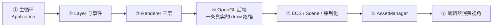

# 代码阅读路线图（Learning Path）

> 目标：给"想读懂这份代码的人类"一条**顺序建议**——七站，从 `main()` 走到编辑器消费视角。每一站给：入口文件、先读哪个类、理解自检问题（"你能说清 X 吗"）、常见误区。
> 阅读前先按 [GettingStarted.md](GettingStarted.md) 把 game/editor 跑起来——每站都建议**边跑边读**（改个常量、按个快捷键、开 F1 Profiler 看打点）。
> 所有路径、类名均对照代码核验（写作时点：2026-10，`docs/guide-p1` 分支，基于 develop `d85fa6d` 快照）。不引用行号。
> 素材与更深的档案索引：`documents/ENGINE_ROADMAP.md`（子系统依赖与阶段史）、`documents/ENGINE_SUMMARY.md`（逐模块的流水账总结）。

## 推荐路线总览

为什么是这个顺序：①② 是"骨架"（谁在驱动一切），③④ 是"骨架上最自洽的一块肌肉"（渲染抽象完整、双后端对照着读最见效），⑤⑥ 是数据的组织方式（实体与资产），⑦ 把全部前面的东西在一个真实消费者里串起来。反过来读（先抠 ECS 或资产）容易迷失在"这段代码被谁调用"里。

一个通用技巧：**每个头文件顶部的注释块都是认真写的**，多数模块读注释块就能拿到设计意图，再看实现核对。

---

## 站 ① 主循环与生命周期

- **入口文件**：`engine/src/DMGameEngine/Core/Application.h` / `Application.cpp`（`MainLoop()` 是全引擎的心脏）；配套 `Core/EntryPoint.h`（引擎提供 `main()`，游戏只实现 `CreateApplication()` 工厂）。
- **两个真实消费者对照读**：`game/src/main.cpp`（`LitCubesGame`，玩法视角）与 `editor/src/main.cpp` + `editor/src/EditorApplication.h/.cpp`（编辑器视角）。两者结构完全一致：`SetAPI` → `CreateApplication` → 生命周期钩子。
- **先读哪个类**：`Application`——构造 → `Initialize()` → `MainLoop()` 五阶段 → `Shutdown()`。游戏侧只 override `OnInitialize / OnUpdate / OnRender / OnEvent / OnShutdown`。
- **自检问题**：
  1. 一帧的五个阶段分别是什么？哪个阶段清屏、清几次？
  2. 为什么事件沿 LayerStack **反向**传播而 Update/Render 正向遍历？
  3. `Timestep` 的 deltaTime 为什么被钳制在 0.1s（`kMaxDeltaTime`）？
  4. 游戏工程的 `main()` 在哪里？`CreateApplication()` 之前引擎做了什么、之后做了什么？
- **常见误区**：
  - 以为主循环持有相机或调用 `BeginScene`——都不。Application 只负责 `ClearFrame()` 一次，render pass 的括号归各层（见站 ③）。
  - 以为 `PushLayer` 的层必须手动挂 ImGui/Profiler——`ImGuiLayer`、`ProfilerLayer`（F1）、`ConsoleLayer`（`` ` ``）都在 `Initialize()` 里自动挂载。

## 站 ② Layer 与事件

- **入口文件**：`Core/Layer.h`、`Core/LayerStack.h`、`Core/Events/Event.h`（及同目录的 `KeyEvent.h` / `MouseEvent.h` / `WindowEvent.h`）、`Core/Input.h`、`Core/Timestep.h`。
- **先读哪个类**：`Layer`（五个虚钩子 + `OnImGuiRender`）、`LayerStack`（层列表与 overlay 区两段结构）。然后跳到站 ① 的 `MainLoop()` 看 LayerStack 是怎么被遍历的——两个文件互相印证。
- **自检问题**：
  1. `PushLayer` 与 `PushOverlay` 的区别在事件传播和 Update 顺序上分别体现为什么？
  2. `WindowResizeEvent` 为什么在层传播**之前**就被派发给 Renderer？
  3. "按住 W 前进"走的是事件还是轮询？"按下 Esc 退出"呢？（答案藏在 `Input::IsKeyPressed` 的轮询模型 + `Input::BeginFrame()` 边沿检测 vs `KeyPressedEvent` 的分发，两条路都要能说清。）
  4. `LayerType`（Platform/Core/Resource/Feature/Tool）影响运行时行为吗？它表达的是什么分层？
- **常见误区**：
  - 在 `OnEvent` 里处理连续输入——连续输入应每帧轮询 `Input`，事件只用于离散动作（可用 `game/src/main.cpp` 的 Esc 处理和 `Scene/EditorCameraController.h` 的鼠标按下记录做对照）。
  - 把 `LayerType` 当成渲染顺序——它是架构分层标签（低层先初始化后关闭），不决定绘制次序。

## 站 ③ Renderer 三层

- **入口文件**：`Renderer/Renderer.h` → `Renderer/RenderCommand.h` → `Renderer/RendererAPI.h`（按这个顺序，恰好是抽象层级从高到低）；然后 `Renderer/RenderQueue.h/.cpp`（延迟提交的灵魂）与 `Renderer/Material.h`。
- **先读哪个类**：`Renderer`——注意它是全静态门面，`s_Queue / s_SceneData / s_LightData` 三个静态成员就是它的全部状态。再读 `RenderQueue::Flush()`，排序、合批、光照上传全在这一个函数里。
- **详细讲解**：本站不展开，见 [RendererTour.md](RendererTour.md)（三层职责、一帧数据流、Material/MaterialInstance、合批与实例化阈值、光照流）。
- **自检问题**（RendererTour §7 有完整版，先给三道最关键的）：
  1. `Submit` 到 `Flush` 之间，绘制请求以什么数据结构存在？为什么"同一材质的 N 个 draw 只绑一次 shader"？
  2. 实例化路径的触发阈值是多少？实例矩阵是怎么进入 GPU 的（uniform 还是顶点属性）？
  3. 为什么 `Material` 没有后端子类，而 `Shader`/`FrameBuffer` 有？
- **常见误区**：
  - 以为 `Submit` 立即执行 GPU 命令——它只是 `push_back` 进队列。
  - 以为光照走 UBO——现状是 per-name uniform 逐个上传（`MAX_POINT_LIGHTS=16`、`MAX_SPOT_LIGHTS=8`），UBO 在 ROADMAP 2b。
  - 混淆 `RenderCommand`（静态 facade）与 `RendererAPI`（实例化的接口）——前者是"怎么调"，后者是"谁来做"。

## 站 ④ 一个具体后端：OpenGL

- **入口文件**：`Platform/OpenGL/` 目录。建议只精读三个文件，其余按需查：`OpenGLRendererAPI.cpp`（每条 `RendererAPI` 虚函数对应的 gl 调用）、`OpenGLShader.cpp`（GLSL 编译 + `GetUniformLocation` 缓存）、`OpenGLFrameBuffer.cpp`（FBO 创建 + `m_PrevBoundFBO` 保存/恢复）。
- **先读哪个类**：`OpenGLRendererAPI`——把站 ③ 的抽象接口逐条对到 `glDrawElements` / `glBindFramebuffer` / `glBlendFunc...`，这一步做完，"抽象层到底抽象了什么"就彻底通了。
- **自检问题**：
  1. `BeginRenderPass(nullptr)` 和 `BeginRenderPass(fb)` 各做了什么？`EndRenderPass` 恢复到哪？
  2. `OpenGLShader` 对不存在的 uniform 返回什么？下游 `glUniform*` 如何处理？（这就是"shader 里没声明的 uniform 会被静默忽略"这条约定的由来。）
  3. 纹理、VA、VB、IB 的创建都走什么模式？（`Create()` 静态工厂按 `Renderer::GetAPI()` 分发——和 `RendererAPI::Create()` 同构。）
- **常见误区**：
  - 在 GL 侧学到的直觉直接套到 Vulkan：clip space Y 方向、sampler 数组写法、in/out 声明要求都不同（`kb/KB-03`）。
  - 想跳过 OpenGL 直奔 Vulkan：**改 Vulkan 前必须先读 `documents/VULKAN_FIXES.md` 台账**（哪些已修/未修以台账为准）与 `documents/VulkanBackendReview.md`，否则很容易重复修或踩回已修的坑。Vulkan 启用方式见 `documents/VULKAN_BACKEND.md`。

## 站 ⑤ ECS / Scene / 序列化

- **入口文件**：`Scene/Scene.h/.cpp`、`Scene/Entity.h`、`Scene/Components/Components.h`（聚合入口，逐个看 `IDComponent / TagComponent / TransformComponent / MeshComponent / CameraComponent / LightComponent`）、`Scene/Systems/System.h` 及三个实现（`TransformSystem / LightSystem / MeshRenderSystem`）、`Scene/SceneSerializer.h/.cpp`。
- **先读哪个类**：`Scene`——它同时是 entt registry 的薄封装、System 的容器和 Transform 层级操作的家。先读头文件注释块，再看 `CreateEntity` 默认挂了哪三个组件。
- **自检问题**：
  1. `Entity` 到底是什么类型？它和 `entt::entity` 怎么互转？同一实体两次加载后 ID 相同吗？
  2. Transform 层级用什么结构存（提示：`TransformComponent` 里的 `Parent / FirstChild / NextSibling` 三条链构成左孩子右兄弟结构）？脏标记如何沿子树传播？`TransformSystem` 为什么必须第一个注册？
  3. `Scene::OnRender()` 为什么不调用 `BeginScene/EndScene`？（ECS_DESIGN §10 方案 A：括号归持有相机的 Layer，见 `Scene/DefaultSceneLayer.h`。）
  4. 序列化加载为什么要**两趟**？（`SceneSerializer.cpp` 的 Load：Pass 1 建实体 + UUID→Entity 映射，Pass 2 按父 UUID 重挂层级。）
- **常见误区**：
  - 往 Component 里写逻辑——红线 R4：Component 纯数据，逻辑进 System（`AGENTS.md`）。
  - 以为 System 有自动发现机制——没有，`AddSystem` 注册顺序即执行顺序，`LightSystem` 必须在 `MeshRenderSystem` 之前。
  - 把 `Scene::DestroyEntity` 想成级联删除——孤儿子实体成为独立根，不重新挂到祖父。
- **详细讲解**：本站不展开，见 [SceneAndECSTour.md](SceneAndECSTour.md)（registry 与组件、三叉链与脏传播、System 数据流、两趟加载与序列化取舍）。
- **约定与陷阱的权威清单**：`kb/KB-04-ECS与场景序列化约定.md`；设计动机：`documents/ECS_DESIGN.md`、`documents/SCENE_DESIGN.md`、概念详解 `documents/ECS_CONCEPTS.md`。

## 站 ⑥ AssetManager

- **入口文件**：`Asset/AssetManager.h/.cpp`、`Asset/AssetTypes.h`（`AssetUUID = uint64_t`、`AssetMetadata`、`AssetTypeOf<T>`）、`Asset/AssetHandle.h`（纯身份 token，只存 UUID 不存路径）、`Asset/AssetLoader.h/.cpp` 与 `Asset/MeshImporterAssimp.cpp`（assimp 导入 + SubMesh 拆分）。
- **先读哪个类**：`AssetManager`（单例）——抓住**三张表**：`m_Registry`（UUID→元数据）、`m_PathToUUID`（路径反查）、`m_Cache`（UUID→`weak_ptr`）。
- **自检问题**：
  1. 为什么按 UUID 而不是路径做资产身份？同一 UUID 加载两次拿到的是同一个对象吗？（缓存命中返回同一 `Ref<T>`。）
  2. `m_Cache` 用 `weak_ptr` 意味着什么？谁负责让资产"活着"？
  3. `Register / LoadRegistry / SaveRegistry` 解决什么问题？（UUID↔路径映射持久化，场景文件里的 UUID 引用跨启动仍有效。）
  4. `Load<T>(path)` 便捷重载遇到陌生路径会做什么？（自动 Register——理解这对"随手加载"和"受管资产"两种用法的影响。）
- **常见误区**：
  - 以为 `AssetHandle` 持有资产——它只是 64 位数字的包装。
  - 以为有异步加载/热重载——现状是同步加载，异步在 ASSET_DESIGN 的完整版规划里。
- **权威清单**：`kb/KB-05-资产系统约定.md`；设计：`documents/ASSET_DESIGN.md`、概念 `documents/ASSET_UUID_CONCEPTS.md`。

## 站 ⑦ 编辑器消费视角

- **入口文件**：`editor/src/EditorLayer.h/.cpp`（面板、快捷键、gizmo、点选、Play 控制）、`editor/src/EditorScene.h/.cpp`（离屏 FB + EditorCameraController + 场景装配 + Play 快照隔离）、`editor/src/SceneDuplicator.h/.cpp`（Play 快照与 Prefab 共用的实体子树深拷贝）、`editor/src/EditorApplication.h/.cpp`。
- **先读哪个类**：`EditorLayer::OnImGuiRender()` 的调用序（dockspace → 菜单 → 各面板）——它是全引擎 API 的**消费清单**；再回头读 `EditorScene::Render()` 看离屏 RTT 括号。
- **Play mode（快照隔离，现行语义）**：进入 Play 时 `EditorScene::EnterPlayMode()` 用 `SceneDuplicator` 把编辑场景**深拷贝**成运行副本（`m_PlayScene`，Mesh/Material 资源按 `DM::Ref` 共享、Play 期间视为只读），此后系统 tick 与 viewport 渲染都作用于副本；Stop 时 `ExitPlayMode()` 丢弃副本、恢复原封不动的编辑场景（`m_EditScene`）——主流引擎语义"Play 里的改动不保留"，选中集按 UUID 快照、Stop 后恢复。不用 `SceneSerializer` JSON 往返做快照的原因：未注册进 AssetManager 的程序化网格会被序列化静默丢掉（KB-07 **K-012**）。
- **自检问题**：
  1. Viewport 里显示的图像从哪来？（`EditorScene` 的 FB 颜色附件 → `GetColorAttachment(0)->GetRendererID()` → `ImGui::Image`。）
  2. 点击 viewport 选中实体的射线是怎么构造的？用到了渲染层的哪份缓存？（逆 view-projection + AABB 相交，`EditorLayer.cpp` 的 DrawViewport 内。）
  3. 场景的新建/打开/保存走什么 UI 路径？（File 菜单项触发，打开/另存为走编辑器内自绘的 ImGui 文件对话框——`EditorLayer.cpp` 的 `Dialog` 状态机；菜单项上显示的 "Ctrl+N/S/O" 只是标注文本，并未实现对应快捷键处理。）gizmo 的 1/2/3/4 分别触发什么？场景保存在什么格式？
  4. 编辑器为什么能直接 `ImGui::Image` 一个 GPU 纹理 ID？这依赖哪条红线（引擎导出 ImGui 符号、编辑器复用同一 context，红线 R7）？
  5. Play 模式里把一个立方体挪走再 Stop，它回得来吗？Play 快照为什么不用 `SceneSerializer` 的 JSON 往返、而用 `SceneDuplicator` 的按值复制 + 资源引用共享？（提示：K-012 与 `SceneDuplicator.h` 文件头注释。）
- **常见误区**：
  - 以为编辑器有独立的渲染路径——它复用的就是站 ③ 的 `Renderer`，只是把 target 换成了离屏 FB。
  - 忽略 `ImGui/ImGuiLayer.h` 是**引擎侧编译并导出**的——编辑器不得再链一份 ImGui。
- **后续**：编辑器自身的路线图与面板划分见 `editor/EDITOR_ROADMAP.md`。

---

## 收尾：把测试当代阅读材料

`engine/tests/` 下五个测试文件（`test_core / test_ecs / test_scene / test_asset / test_assimp_import`）是**最小的可运行用法示例**——每站读完回来跑一遍对应测试、改动断言看它怎么失败，是验证"真的读懂了"最便宜的方式。构建与运行方式见 [GettingStarted.md](GettingStarted.md) §6。

通读完成后，按兴趣分流：

- 想做渲染特性 → 先读 `documents/ENGINE_ROADMAP.md` §2b（双后端收敛）与 `documents/LIGHTING_ASSESSMENT.md`，理解"为什么阴影/PBR 要等 2b"。
- 想做编辑器功能 → `editor/EDITOR_ROADMAP.md` + 站 ⑦。
- 想修 Vulkan → `documents/VULKAN_FIXES.md` 台账先行（站 ④ 的告诫）。
- 想了解各模块历史决策的来龙去脉 → `documents/` 根下 17 篇工程档案，从 `ENGINE_REVIEW.md` 与 `ENGINE_SUMMARY.md` 入手。

> 本路线图与代码的同步约定：develop 有大合并后由文档 Agent 核对增量（见 `playbooks/PB-06-人类向文档撰写.md`）；发现路线与代码不符时，以代码为准并反馈文档 Agent。
