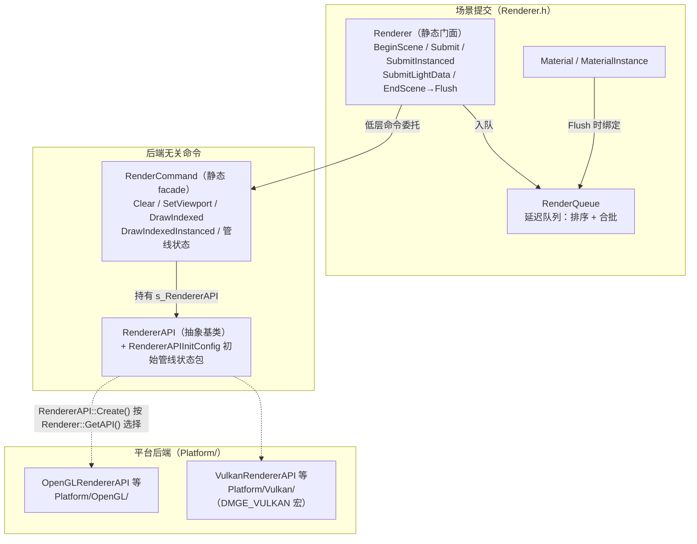
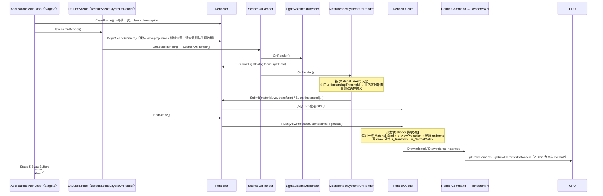
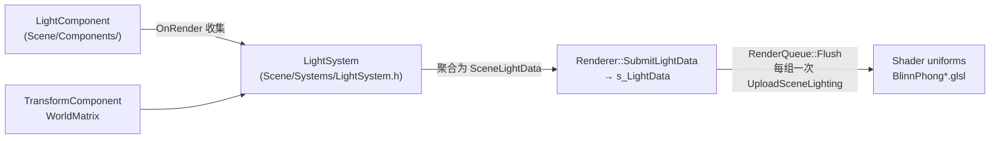

# 渲染子系统导览（Renderer Tour）

> 目标：读完本文，你能说清渲染三层抽象各自的职责、一帧从 `Scene::OnRender` 到 GPU 的完整数据流、Material/MaterialInstance 的关系、离屏 RTT 与光照数据的走向，以及 OpenGL / Vulkan 双后端的差异概况。
> 本文所有路径、类名、常量值均对照代码核验（写作时点：2026-10，`docs/guide-p1` 分支，基于 develop `d85fa6d` 快照）。文中不引用行号——代码会演进，用类名/函数名定位。
> 双后端的深度细节（正确性 A-F、性能 P0-P3、修复台账）**不在本文复制**，见 [kb/KB-03](../../../kb/KB-03-渲染双后端注意事项.md) 与工程档案 `documents/VulkanBackendReview.md`、`documents/VULKAN_FIXES.md`、`documents/VULKAN_BACKEND.md`。

## 1. 三层抽象：Renderer / RenderCommand / RendererAPI

渲染代码都在 `engine/src/DMGameEngine/Renderer/`，后端实现在 `engine/src/DMGameEngine/Platform/OpenGL/` 与 `Platform/Vulkan/`。三层各自回答一个问题：

| 层 | 文件 | 回答的问题 | 关键形态 |
|---|---|---|---|
| `Renderer` | `Renderer/Renderer.h/.cpp` | "这个场景要画什么？" | 场景级语义：相机、光照、绘制请求入队。全静态类 |
| `RenderCommand` | `Renderer/RenderCommand.h/.cpp` | "怎么把一条 GPU 命令发出去？" | 静态门面（facade），持有当前后端实例，转发状态/绘制命令 |
| `RendererAPI` | `Renderer/RendererAPI.h/.cpp` | "具体到某个图形 API 该调什么？" | 纯虚接口 + `Create()` 工厂，OpenGL/Vulkan 各派生一份 |

几个容易读漏的设计点（都能在头文件注释里找到原话）：

- **Renderer 自己不持有后端**。它把低层调用委托给 `RenderCommand`；`RenderCommand` 里的 `s_RendererAPI`（`DM::Scope<RendererAPI>`）才是后端实例的唯一持有者。场景无关代码（ImGui 层、调试工具）可以直接用 `RenderCommand`，不必经过 `Renderer`。
- **后端选择有两道闸**：编译期——Vulkan 代码在 `DMGE_VULKAN` 宏下才编译进 DLL（`engine/CMakeLists.txt` 里由 CMake 选项 `DMGE_VULKAN_BACKEND=ON` 定义）；运行期——`Renderer::SetAPI(Renderer::API::...)` 设定枚举，`RendererAPI::Create()` 据此实例化对应后端（`RendererAPI.cpp`）。`API` 枚举里还预留了 `DirectX`，`Create()` 对它直接断言失败。
- **初始管线状态是数据不是代码**：`RendererAPIInitConfig`（clear color、depth、cull、blend 的默认值）在 `RendererAPI::Init` 里经虚函数下发，让每个后端用自己的 API 落地同一份"默认管线状态"。
- **render pass 也抽象在 `RendererAPI` 层**：`BeginRenderPass(FrameBuffer*)` / `EndRenderPass()`。对 OpenGL 是绑定/恢复 FBO（`OpenGLFrameBuffer` 记住 `m_PrevBoundFBO`，Unbind 时恢复）；对 Vulkan 是动态渲染 pass 的开始/结束。

## 2. 一帧的完整数据流：从 Scene::OnRender 到 GPU

前置（主循环五阶段的整体框架见 [ArchitectureOverview.md](ArchitectureOverview.md)）：Application 在 Stage 3 调 `Renderer::ClearFrame()` 清屏**一次**，然后正向遍历各层的 `OnRender()`。渲染 pass 的括号（`BeginScene`/`EndScene`）归**持有相机的层**——玩法层由 `Scene/DefaultSceneLayer.h` 的 `OnRender()` 括出，编辑器由 `editor/src/EditorScene.cpp` 的 `Render()` 括出。`Scene` 自己不括 pass（ECS_DESIGN §10 方案 A）。

以 demo 游戏（`game/src/main.cpp` 的 `LitCubeScene`）为例：

逐段拆开：

**① 提交（MeshRenderSystem）**。`Scene/Systems/MeshRenderSystem.h` 的 `OnRender()` 两阶段：先遍历 `TransformComponent + MeshComponent` 视图，按 `(Material*, Mesh*)` 哈希分组，收集每个实体的 `WorldMatrix`；材质取 `MeshComponent::MaterialOverrides[0]`，没有 override 就从 `AssetManager` 按 `SubMeshes[0].MaterialAsset` 加载。然后逐组决定走哪条路：

- **实例化路径**：组内实体数 ≥ `kInstancingThreshold`（**常量值 8**，`MeshRenderSystem.h` 内定义）时，从缓存取（或创建）一张"实例化 VA"——实例 buffer 排在前面占 location 0-3（每实例一个 mat4），网格顶点属性顺移到 4+；每帧把变换矩阵 `SetData` 进实例 buffer。一批上限 `kMaxInstances = 4096` 个实例，超了切多批，每批一次 `Renderer::SubmitInstanced`。
- **逐 draw 路径**：小组合（或有 per-instance `MaterialInstance` override 的场景）退回每实体一次 `Renderer::Submit(material, va, transform)`。

**② 排序与合批（RenderQueue）**。`Renderer/RenderQueue.cpp` 的 `Flush()` 把逐 draw 队列按 `(有无 Material, 对象指针)` 排序——同一 Material / Shader 的请求变连续；每组只在**第一个** draw 时绑定材质、上传 `u_ViewProjection`、上传整套光照 uniforms（`UploadSceneLighting`），之后的 draw 只传 `u_Transform` 与法线矩阵 `u_NormalMatrix`，然后 `DrawIndexed`。实例化批次存在一个**定长数组**里（`kMaxInstancedBatches = 32` 批），不用 `std::vector`——原因见文件注释：跨 DLL 边界修改 vector 的迭代器调试级别不匹配会破坏其内部记账（详见 `kb/KB-02-DLL边界与STL.md`）。逐 draw 的 `m_Queue` 成员本身仍是 vector，但它只在 DLL 内的 `Flush` 中被修改。

**③ 后端 draw**。`RenderCommand::DrawIndexed(*va)` → `OpenGLRendererAPI::DrawIndexed` → `glDrawElements`。Vulkan 同名虚函数走 `vkCmdDrawIndexed`。

**为什么这么绕？** 一句话：把"每 draw 一次"的状态切换摊销成"每**组**一次"。1500 个共享同一 `MaterialInstance` 的立方体在实例化路径下收敛成 1 个批次、1 次材质绑定、1 次 `DrawIndexedInstanced`。

## 3. Material 与 MaterialInstance

`Renderer/Material.h`（实现 `Material.cpp`），纯抽象层——**没有**后端子类，只通过 `Shader` / `Texture` 抽象操作：

- `Material` = 一个 `Ref<Shader>` + 命名 uniform 值表（`std::variant<int, float, vec2..vec4, mat4, vector<int>>`）+ 纹理槽表（sampler 名 → `TextureSlot{Texture, Slot}`）。`Bind()` 一次完成：绑 shader、上传全部 uniform、逐槽绑纹理并 set sampler uniform。
- `MaterialInstance` **继承** `Material`，构造时引用一个共享的 base Material，另存自己的 `m_Overrides` / `m_TextureOverrides`。`Bind()` 的顺序是：base 的 `Bind()`（shader + 共享 uniform + 基础纹理）→ 叠加实例的 uniform override → 叠加纹理 override。改实例**永不触碰** base。
- demo 的用法（`game/src/main.cpp`）：一个 base `Material`（Blinn-Phong 参数），1500 个立方体共享**同一个** `MaterialInstance`（`m_SharedMaterial`）；太阳和点光的"灯泡"方块各用一个 unlit `MaterialInstance`。

## 4. 离屏 RTT（render-to-texture）

`Renderer/FrameBuffer.h`：`FramebufferSpecification` 描述尺寸、颜色附件列表、深度格式；`SwapChainTarget=false`（默认）即离屏目标。颜色附件可经 `GetColorAttachment(i)` 拿到 `Texture2D`，供后续采样/显示。`Renderer::BeginScene(camera, target)` 把本 pass 的输出重定向进指定 FrameBuffer（`nullptr` = 交换链/默认帧缓冲）；还有一条"只配相机"的便利路径——`BeginScene(camera)` 自动取 `camera.GetRenderTarget()`，target 非空即离屏（`SceneCamera::SetRenderTarget` 可设置，`Camera` 基类默认返回 `nullptr`）。

当前**真正落地**的用途：

1. **编辑器 Viewport**（`editor/src/EditorScene.cpp`）：构造时创建离屏 FB（RGBA8 + Depth，初始 1280×720）；`Render()` 里 `Renderer::BeginScene(m_Camera->GetCamera(), m_FB)` → `SetViewport(FB 尺寸)` → `Scene::OnRender()` → `EndScene()`。`editor/src/EditorLayer.cpp` 的 `DrawViewport()` 用 `GetColorAttachment(0)->GetRendererID()` 作为 `ImTextureID` 交给 `ImGui::Image` 显示（UV 上下翻转）。viewport 尺寸变化走 `EditorScene::Resize` → `m_FB->Resize`。顺带一提：编辑器的**鼠标点选实体**也建立在这条链上——用逆 view-projection 从点击处反投影出射线，对每个 Mesh 实体做世界空间 AABB 相交测试。
2. **相机自带渲染目标（机制就位，尚无调用方）**：`SceneCamera` 支持挂 `RenderTarget`，挂上后 `BeginScene(*this)` 自动离屏。这是为阴影贴图/后处理/多视口预留的钩子——按写作时点的代码，引擎与两个消费者都还没有给它设值的地方。（2026-10 复核：`SetRenderTarget` 在 engine/editor/game 源码内仍只有声明、无调用方，本条继续成立。）

> ⚠️ 一个已知的注释漂移：`FrameBuffer.h` 文件头注释声称"离屏 FrameBuffer 接入渲染 pass 模型是 follow-up、渲染目前总是打到交换链"——这与现状不符（`BeginScene`/`BeginRenderPass` 的 target 路径已实现并被编辑器使用）。以代码为准，注释属于历史残留。

## 5. 光照数据流：组件 → LightSystem → shader uniform

- **数据结构**（`Renderer/Light.h`）：`DirectionalLightData` / `PointLightData` / `SpotLightData` / 聚合的 `SceneLightData`，上限 `MAX_POINT_LIGHTS = 16`、`MAX_SPOT_LIGHTS = 8`。纯数据结构，Renderer 与 Scene 两层都能 include 而不引入后端头。
- **收集**（`Scene/Systems/LightSystem.h` 的 `OnRender`）：世界坐标取自 WorldMatrix 平移列；方向取旋转部分第 2 列归一化后**取反**（光源沿局部 -Z 发射，OpenGL 约定）；**首个方向光**兼作环境光来源（`AmbientColor` = 灯色，`AmbientIntensity` = 该灯的环境强度）；超上限的灯静默丢弃。注意 System 注册顺序即执行顺序——`LightSystem` 必须在 `MeshRenderSystem` **之前**注册（demo 与编辑器都是 Transform → Light → Mesh 这个顺序）。
- **上传**：`Renderer::SubmitLightData` 存入静态 `s_LightData`；`RenderQueue::Flush` 对每个材质/shader 组调用 `UploadSceneLighting`，按名字逐个 `SetFloat3/SetFloat...`（`u_AmbientColor`、`u_DirectionalLight_*`、`u_PointLights_position[i]`、`u_SpotLights_*`…）。shader 侧对应 `engine/shaders/BlinnPhong.glsl` 与 `BlinnPhongInstanced.glsl`（前向 Blinn-Phong）。
- **重要现状**：这是 **per-name uniform 上传，不是 UBO**。`Light.h` 注释明说上限保持较小就是为了让逐名上传停留在几十次 `SetFloat3` 以内；UBO（以及 SPIR-V 反射）属于 ROADMAP 2b 收敛的一部分。光照现状与阴影/PBR 的依赖关系见 `documents/LIGHTING_ASSESSMENT.md` 与 KB-03。

## 6. 双后端差异速览

拓扑：OpenGL 默认且总是可用；Vulkan 1.3 需 `-DDMGE_VULKAN_BACKEND=ON`（Vulkan SDK：VMA + shaderc）编译；`Renderer::SetAPI` 运行时切换。game 与 editor 的 `CreateApplication()` 目前都显式 `SetAPI(API::OpenGL)`。

| 维度 | OpenGL（`Platform/OpenGL/`） | Vulkan（`Platform/Vulkan/`） |
|---|---|---|
| shader | GLSL 直接编译 | GLSL 源经 **重写桥接**（`VulkanShader.cpp` 的 `RewriteStageBody` 注入 in/out location、按 std140 重排）后经 shaderc 编译 |
| clip space | 原样使用 | `BeginScene` 里对 view-projection 做 **Y 翻转**（Vulkan Y 轴朝下；配套 frontFace flip 保持背面剔除行为一致） |
| render pass | 绑定/恢复 FBO | 动态渲染 + swapchain 重建、pipeline 缓存、per-frame deletion queue（`VulkanDeletionQueue.h`） |
| 已知坑 | assimp 导入未用 FlipUVs，个别格式 UV 方向可能要 per-format 调整 | pipeline 缓存不随 swapchain 重建清空（A）、无帧内延迟销毁（B）、反射式 UBO 靠 regex（E）……以修复台账为准 |

这里**只给索引，不给细节**（修任何 Vulkan 东西之前务必先读台账，别重复修也别假设已修）：

- 正确性 A-F + 性能 P0-P3 全文：`documents/VulkanBackendReview.md`
- 逐项修复台账：`documents/VULKAN_FIXES.md`
- 启用与构建指南：`documents/VULKAN_BACKEND.md`
- 架构债 E1（OpenGL-first 渗漏：Y 翻转 hack、GLSL 重写桥接）与收敛方向（SPIR-V 反射 + RenderPassDesc + 资源屏障）：`kb/KB-03`、`documents/ENGINE_ROADMAP.md` §2b
- 红线 R5：新抽象必须后端无关，禁止 GL 心智模型渗入公共接口（`AGENTS.md`）

## 7. 自检问题

读完本文，试着不翻代码回答：

1. `Renderer::Submit` 被调用后，GPU 知道这件事吗？到 `Flush` 之前，这次绘制请求躺在哪里、被什么字段描述？
2. 为什么 `RenderQueue` 的实例化批次用定长数组而逐 draw 队列用 `std::vector`？
3. `kInstancingThreshold` 是多少？一个组正好低于阈值时会走什么路径、产生多少次 draw call 与材质绑定？
4. 1500 个立方体共享一个 `MaterialInstance`，为什么改其中一个的 uniform 不会影响其他 1499 个？（提示：这个前提本身在 demo 里成立吗？）
5. 编辑器 viewport 里点击一个立方体，选中判定是怎么做的？它复用了渲染管线的哪份数据？
6. 场景里有 20 个点光会怎样？光照数据是走 UBO 进 shader 的吗？
7. 同一份 Blinn-Phong GLSL 能同时在两个后端工作吗？中间隔了什么？

## 8. 深入阅读

- 代码主路径：`Renderer/Renderer.cpp`（pass 括号与队列生命周期）→ `Renderer/RenderQueue.cpp`（排序合批与光照上传的全部细节）→ `Platform/OpenGL/OpenGLRendererAPI.cpp`（一条真实的 draw 路径）
- ECS 侧配合：`Scene/Systems/MeshRenderSystem.h`、`Scene/Systems/LightSystem.h`
- 工程档案（只增不毁的历史档案，本文不复制其内容）：`MATERIAL_OVERRIDE_SERIALIZATION.md`（Material override 序列化）、`LIGHTING_ASSESSMENT.md`、`ECS_DESIGN.md`（§10 渲染括号归属）
