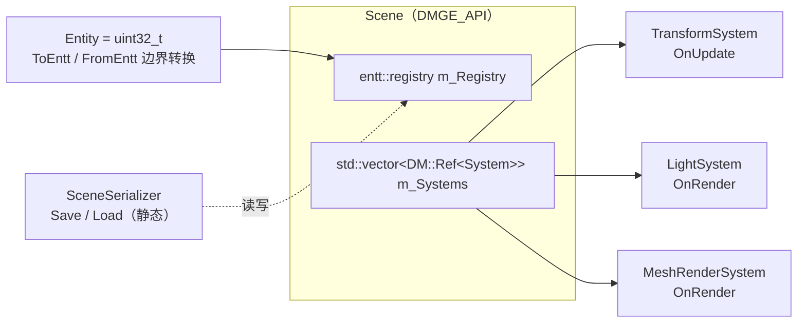
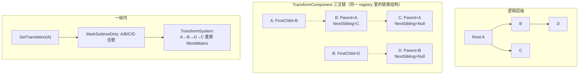
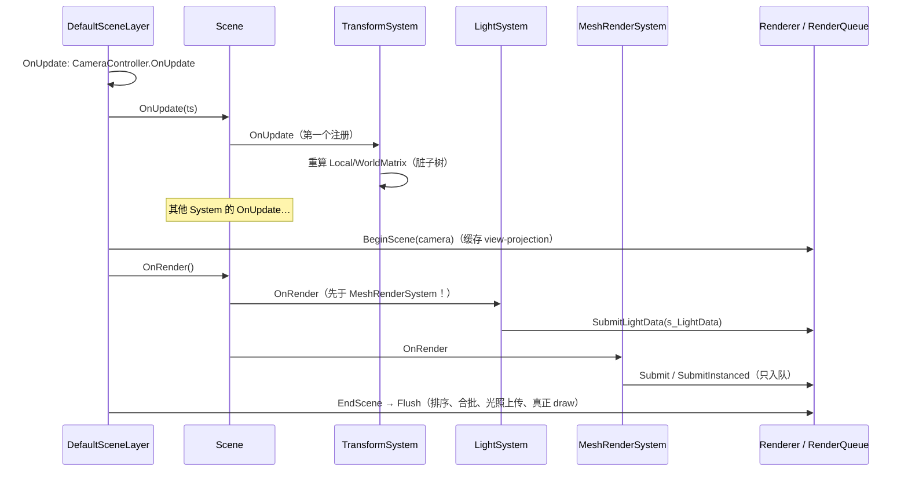

# 场景与 ECS 导览（Scene & ECS Tour）

> 本文展开 [LearningPath.md](LearningPath.md) 站 ⑤：`Scene`、entt registry、组件、Transform 层级与 System 机制、`.scene` 序列化。
> 所有路径、类名、数字均对照代码核验（写作时点：2026-10，`docs/tours` 分支，基于 develop `fba9955` 快照）。不引用行号。
> 权威约定清单：`kb/KB-04-ECS与场景序列化约定.md`；设计动机与概念详解：`documents/ECS_DESIGN.md`、`documents/ECS_CONCEPTS.md`、`documents/SCENE_DESIGN.md`。

## 1. 总览：五样东西各管什么

| 名字 | 位置 | 一句话职责 |
|---|---|---|
| `Scene` | `engine/src/DMGameEngine/Scene/Scene.h/.cpp` | 拥有 `entt::registry` + System 列表 + Transform 层级操作，是本站的主角 |
| `Entity` | `Scene/Entity.h` | **只是 `uint32_t` 的别名**，无数据无方法；`NullEntity = (Entity)-1` |
| 组件 | `Scene/Components/`（聚合入口 `Components.h`） | 纯数据 POD，红线 R4：不许有行为逻辑 |
| `System` | `Scene/Systems/System.h` + 三个实现 | 纯逻辑：按组件类型批量查询处理，持 `Scene&` 访问 registry |
| `SceneSerializer` | `Scene/SceneSerializer.h/.cpp` | `.scene` JSON 往返，nlohmann/json 是 PRIVATE 依赖，不出头文件 |



三个阅读入口：

1. `Scene.h` **头文件注释块**——先读它，模块自述了生命周期与层级策略；
2. `Scene.cpp` 的 `CreateEntity` / `DestroyEntity` / `SetParent`——层级三叉链的所有维护逻辑都在这一个文件里；
3. `SceneSerializer.cpp` 的 `Load()`——两趟加载一目了然（§5）。

## 2. Entity 与 registry：身份即数字

- `Entity` 就是 `uint32_t`（`Scene/Entity.h`），同一实体的运行时 ID **每次加载都会变**——稳定身份由 `IDComponent.UUID` 承担（`CreateEntity` 里用 `std::mt19937_64` 生成 64 位学习级随机 UUID）。这也是序列化必须两趟的根本原因（§5）。
- `Scene` 对 entt 的转换收敛在两个私有静态函数：`ToEntt` / `FromEntt`（`Scene.h`）。公开 API（`AddComponent / GetComponent / HasComponent / RemoveComponent`）都收 `Entity`，entt 头文件不出引擎公共 API（ECS_DESIGN §12 方案 A，Hazel 风格别名）。
- `Scene` 不可拷贝（拥有 registry + 带 `Scene&` 回引的 System 列表）。

**自检**：`Entity` 和 `entt::entity` 怎么互转？同一实体两次加载后运行时 ID 相同吗？（相同的是 `IDComponent.UUID`，不是 ID。）

## 3. 组件清单与两个"默认三件套"

聚合入口 `Scene/Components/Components.h` 当前收录 6 个核心组件：

| 组件 | 关键字段 | 备注 |
|---|---|---|
| `IDComponent` | `uint64_t UUID` | 稳定身份，序列化的锚点 |
| `TagComponent` | `std::string Tag` | 编辑器 Hierarchy/Inspector 显示的名字 |
| `TransformComponent` | local TRS + 三叉链 + 运行时矩阵缓存 | §4 专述 |
| `MeshComponent` | `AssetHandle MeshAsset` + `DM::Ref<Mesh> Mesh` + `MaterialOverrides` | 只存 UUID，运行时经 AssetManager 恢复（§6） |
| `CameraComponent` | `SceneCamera Camera` + `Primary` + `FixedAspectRatio` | 已定义并参与序列化；相机驱动现状见 §7 |
| `LightComponent` | 类型/颜色/强度/衰减/锥角/环境光 | 方向约定：沿实体局部 -Z（`LightSystem.h` 头注释） |

> 注意：组件清单以 `Components.h` 实际内容为准，**不是固定 6 个**——引擎在并行开发中可能新增组件（聚合入口注释也写了 "Add new Component includes here"）。本文只逐个讲清现存 6 个。

两个"默认三件套"：

- `Scene::CreateEntity(tag)` 自动挂 `IDComponent + TagComponent + TransformComponent`——所以**每个实体必有稳定身份、名字和变换**，序列化也依赖这个前提（Pass 1 直接复用 `CreateEntity` 再覆写 UUID）。
- 编辑器侧 Create Empty 走的就是它（见 [EditorTour.md](EditorTour.md)）。

**自检**：为什么 `MeshComponent` 存 `AssetHandle` 而不是 `Ref<Mesh>` 直接序列化？（`Ref` 是运行时资源，序列化只该存身份——UUID；恢复交给 AssetManager，见站 ⑥ 与 [RendererTour.md](RendererTour.md) 的 Mesh 一节。）

## 4. Transform 层级：三叉链 + 脏标记

`TransformComponent` 一份结构体里装了三类数据（头注释明确写了哪些序列化、哪些运行时）：

```cpp
// 序列化：local TRS
glm::vec3 Translation{0.0f};  glm::vec3 RotationEuler{0.0f};  glm::vec3 Scale{1.0f};
// 层级：左孩子右兄弟三叉链（存 Entity ID，不是指针——组件保持定长 POD）
Entity Parent, FirstChild, NextSibling;
// 运行时缓存（不序列化，加载后重算）
glm::mat4 LocalMatrix, WorldMatrix;  bool Dirty = true;
```

### 4.1 三叉链怎么连

`SetParent(child, newParent)`（`Scene.cpp`）：先把孩子从旧父的兄弟链上摘下来（`DetachFromParent`），再**头插**到新父的孩子链（`NextSibling = 新父的 FirstChild`，`新父.FirstChild = child`）。入链前用 `IsDescendant` 走 Parent 链**拒绝环**——否则 `TransformSystem` 的递归会死循环。

`DestroyEntity` 不做级联：子实体逐个变成独立根（`Parent = NullEntity`，`Dirty = true`），**不会**重新挂到祖父——想改策略是调用方的事（头注释原话）。

### 4.2 脏标记传播与重算

- **标脏**：`SetTranslation / SetRotation / SetScale` 改字段 → `Dirty = true` → `MarkSubtreeDirty(e)` 沿 FirstChild/NextSibling 链递归标脏整棵子树（已脏的分支**剪枝**跳过）。
- **重算**：`TransformSystem::OnUpdate` 遍历所有根（`Parent == NullEntity`）深度优先；`LocalMatrix = T * R * S`（欧拉角转四元数），`WorldMatrix = parentWorld * LocalMatrix`——父先于子，拓扑序天然成立。遇到**不脏**的节点直接整棵子树短路（传播算法保证了"父干净 ⇒ 子树必干净"）。



契约（`TransformSystem.h` 头注释）：**改变换必须走 `Scene::Set*` 三个 setter**（或手动 `Dirty=true` + `MarkSubtreeDirty`），直接改字段会被重算静默忽略。

**自检**：为什么 `TransformSystem` 必须第一个注册？（不是名字里有"Transform"所以排前面——见 §7，注册顺序即执行顺序，`MeshRenderSystem` 提交 draw 时读的是 `WorldMatrix`。）

## 5. 序列化：`.scene` JSON 与两趟加载

`SceneSerializer` 对外只有 `Save(scene, path)` / `Load(scene, path)` 两个静态函数；组件的（反）序列化函数登记在内部一个 **类型名 → (SerializeFn, DeserializeFn) 注册表**（Hazel 风格手写）。当前登记 4 个：`Transform / Mesh / Camera / Light`——ID 和 Tag 由 Save/Load 主体直接处理（`Save` 遍历 `view<IDComponent>` 写 `uuid` + `tag`）。

### 5.1 两趟加载为什么必须

场景文件里每个实体记录的父引用是**父实体的 UUID**（`"parent": 0 = 根`），而运行时 `Entity` ID 每次加载都不同。所以：

- **Pass 1**：逐实体 `CreateEntity(tag)`（默认三件套已挂好）→ **覆写** `IDComponent.UUID` 为文件值 → 建 `uuidToEntity` 映射 → 反序列化各组件字段、暂存 `entityToParentUUID`；
- **Pass 2**：按暂存的父 UUID 查表，`scene.SetParent(e, it->second)` 重挂层级。

### 5.2 两条关键取舍

1. **存 local 不存 world**：`SerializeTransform` 只写 translation/rotation/scale（欧拉角，序列化友好），不写 `LocalMatrix/WorldMatrix/Dirty`——加载时 `Dirty = true`，交给 `TransformSystem` 第一帧重算（KB-04 硬纪律 4：world matrix 运行时算不存储）。
2. **资产只存 UUID**：`MeshComponent` 序列化只写 `meshAsset`（UUID）；材质更省——只有 per-instance 的 `MaterialOverrides` 覆盖表入库（`submesh` 下标 + 覆盖的 uniform 名值对），**基础材质不存**，加载时从 `Mesh.SubMeshes[i].MaterialAsset` 经 AssetManager 重建（详见 `documents/MATERIAL_OVERRIDE_SERIALIZATION.md`）。代价：引用的 Mesh/Material UUID 必须已在 AssetManager 的 registry 里（`LoadRegistry` 过），否则静默加载不到。

Camera/Light 是全字段 POD 序列化（`primary / fixedAspectRatio / projectionType / perspective / orthographic`；`type / color / intensity / ...`），无运行时缓存问题。

**自检**：为什么不能把父引用存成运行时 Entity ID 或数组顺序？（ID 跨加载不稳定；顺序无法表达任意树——KB-04"层级重建靠父 UUID"。）

## 6. 一帧的数据流：Update 与 Render 分两段

`Scene::OnUpdate(ts)` 依次调每个 System 的 `OnUpdate`；`Scene::OnRender()` 依次调每个 System 的 `OnRender`。**`Scene::OnRender` 不调用 `BeginScene/EndScene`**——渲染括号归持有相机的 Layer（ECS_DESIGN §10 方案 A），游戏侧的推荐宿主是 `Scene/DefaultSceneLayer.h`（header-only）：`OnRender` 里 `BeginScene(camera)` → `OnSceneRender()`（默认即 `Scene::OnRender()`）→ `EndScene()`；`OnUpdate` 里先 tick 相机控制器再 tick `Scene::OnUpdate`。



System 部分（`Scene/Systems/`）：

- **`TransformSystem`**（`OnUpdate`）：见 §4.2。
- **`LightSystem`**（`OnRender`）：每帧收集 `LightComponent + TransformComponent`，从 `WorldMatrix` 提取世界坐标与 -Z 前向，聚合进 `SceneLightData` 后 `Renderer::SubmitLightData`。方向光取第一个（顺带驱动环境光项）；点光/聚光上限 `MAX_POINT_LIGHTS = 16` / `MAX_SPOT_LIGHTS = 8`（`Renderer/Light.h`）。
- **`MeshRenderSystem`**（`OnRender`）：双路径——先按 (Material, Mesh) 分组，组内实例数 **≥ 8**（`kInstancingThreshold`）走 `SubmitInstanced`（实例缓冲上限 `kMaxInstances = 4096`，实例矩阵占 attribute location 0–3，网格顶点属性从 4 起）；否则逐实体 `Submit`。材质优先取 `MaterialOverrides[0]`，否则用 Mesh 资源的 SubMesh 默认材质。

**注册顺序即执行顺序**：`Scene::AddSystem` 就是 `push_back`，没有自动发现机制。现役三个的隐含约束是 `LightSystem` 必须在 `MeshRenderSystem` 之前注册（都在 `DefaultSceneLayer` 的括号内跑）——两者都依赖 `TransformSystem` 先算好 `WorldMatrix`。

## 7. 与相邻模块的接缝

- **相机现状**：`CameraComponent` 已定义、已序列化，但**尚未接管渲染相机**——`DefaultSceneLayer` 的 view-projection 仍由 `CameraController` 驱动（`CameraComponent.h` 头注释明确写了这是留给后续的迁移）；编辑器侧的视角相机是 `Scene/EditorCameraController.h`（见 [EditorTour.md](EditorTour.md)）。
- **资产侧**：`MeshComponent.MeshAsset` → `AssetManager::Load<Mesh>` 的恢复链路属站 ⑥，见 `kb/KB-05-资产系统约定.md` 与 `documents/ASSET_DESIGN.md`。
- **编辑器侧**：Inspector 的组件编辑 UI、Hierarchy 面板、Play 快照如何消费本站的 `Scene`/`SceneDuplicator`，见 [EditorTour.md](EditorTour.md)。
- **测试即示例**：`engine/tests/test_ecs.cpp`（registry/组件/层级）与 `test_scene.cpp`（序列化往返）是最小可运行用法；序列化加新组件时，往返测试是兜底（KB-04）。

## 8. 常见误区速查

- 把 `Entity` 当对象——它是 `uint32_t` 句柄，数据全在 registry 的组件表里。
- 往 Component 里写方法——红线 R4，逻辑进 System（`AGENTS.md`）。
- 遍历中直接增删组件——entt 迭代器失效，先收集后改（KB-04）。
- 直接改 `TransformComponent` 字段——不脏不重算；走 `Scene::Set*`。
- 以为 `DestroyEntity` 级联——子实体变独立根，不挂祖父。
- 以为序列化存 world matrix 或材质全量——只存 local TRS 与 UUID/覆盖表。
